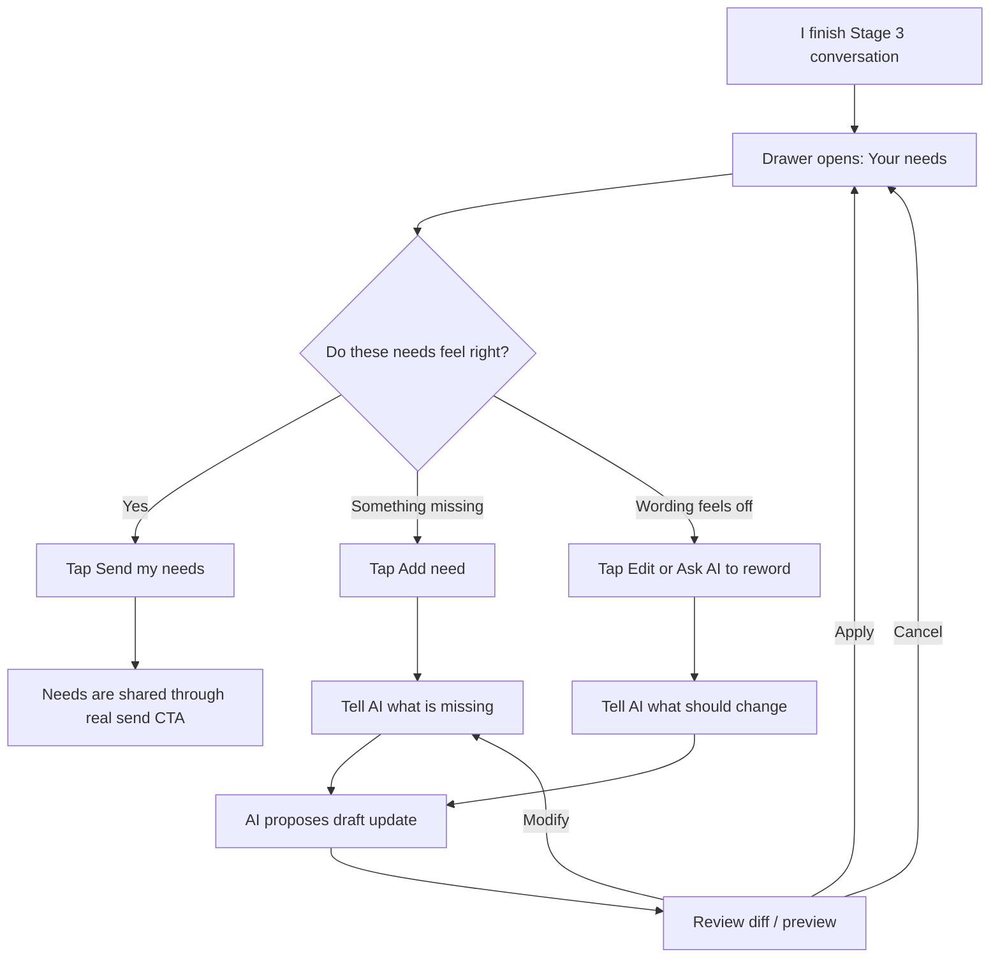
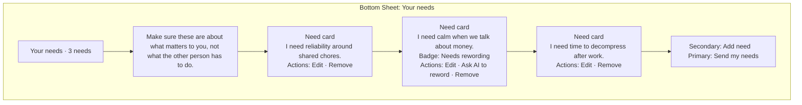
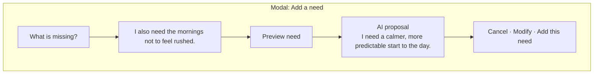
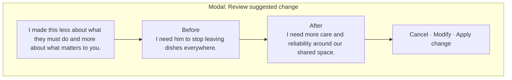
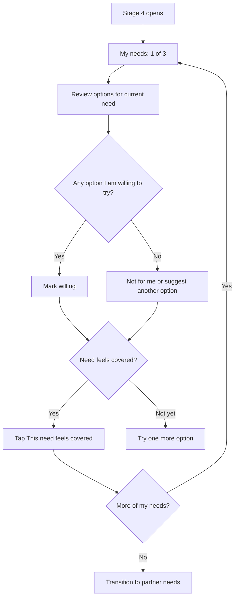
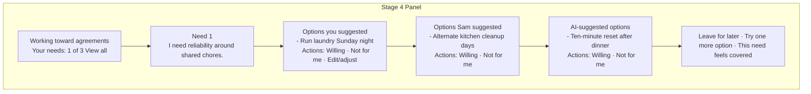
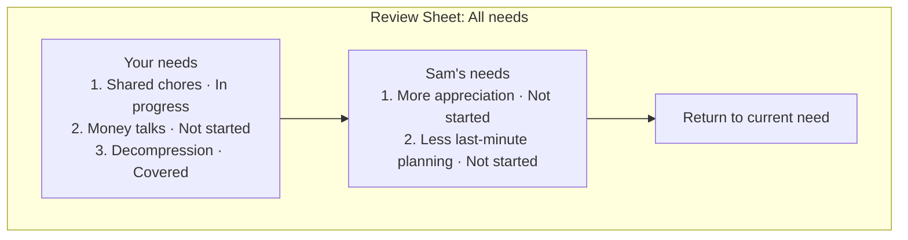
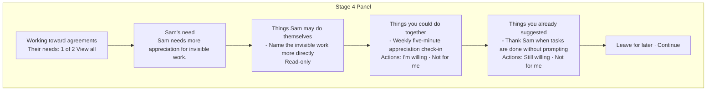
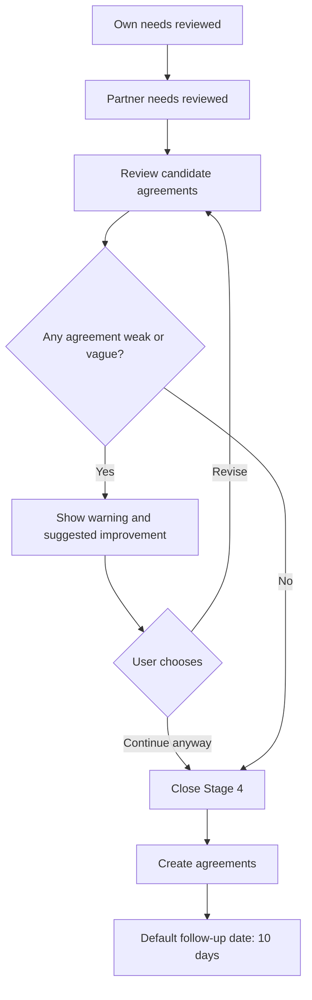
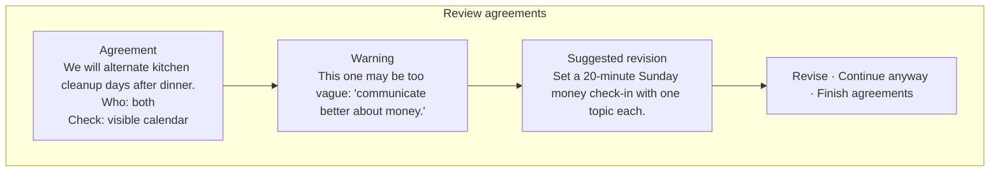

# /goal Prompt: Implement the Stage 3 and Stage 4 Rework

Use this prompt as the body for a large `/goal` session.

## Objective

Implement the Stage 3 and Stage 4 rework described in PR #635 for `shantamg/meet-without-fear`, then verify it with seeded deterministic sessions and local browser flows.

The target product outcome is:

- Stage 3 lets each user comfortably steer, review, confirm, and send their own AI-drafted needs.
- Stage 3 needs are framed as universal, self-referential needs, not blame or strategies aimed at the other person.
- Stage 3 conversational need edits use a plan/preview/apply architecture modeled on First Circle's AI transcript editing flow, adapted to MWF's existing AI-draft refinement pattern.
- Stage 4 walks each user through one need at a time, starting with that user's own needs, then the partner's needs.
- Stage 4 presents available options in context, supports user/partner/AI-suggested options, confirms willingness, and asks whether each need feels sufficiently addressed.
- Stage 4 ends with a co-built summary of commitments, including a quality check and a roughly 10-day follow-up/check-in date.

## Source Material

Read these before coding:

- PR #635: https://github.com/shantamg/meet-without-fear/pull/635
- PR branch docs, if not already merged locally:
  - `docs/product/stages/stages-3-4-rework-spec.md`
  - `docs/product/stages/stages-3-4-rework-impl-spec.md`
- Current living docs:
  - `docs/product/stages/stage-3-what-matters.md`
  - `docs/product/stages/stage-4-strategic-repair.md`
  - `docs/backend/api/stage-3.md`
  - `docs/backend/api/stage-4.md`
  - `docs/backend/prompts/stage-3-needs.md`
  - `docs/backend/prompts/stage-4-repair.md`
  - `docs/backend/prompt-caching.md`
  - `docs/backend/state-machine/retrieval-contracts.md`
  - `CLAUDE.md`

If the PR branch docs are not present in the checkout, fetch them without switching branches:

```bash
git fetch origin pull/635/head:refs/remotes/origin/pr/635
git show origin/pr/635:docs/product/stages/stages-3-4-rework-spec.md
git show origin/pr/635:docs/product/stages/stages-3-4-rework-impl-spec.md
```

## Product Decisions Confirmed by Shantam

These are the implementation decisions for the `/goal` session.

1. **Stage 4 authorship: use explicit authorship.**
   Surface whether an option originated from the current user's side, the partner's side, or AI. Do not hide partner authorship/source. Shantam's reasoning: if the user recognizes the options they brought, then the unfamiliar options are obviously the other person's anyway; mixing everything together just makes the experience more confusing. This is a source label, not permission for raw user-authored partner-facing messages.

2. **Stage 3 reframing/editing: First Circle-style interpret/preview/apply flow.**
   The user should be able to conversationally say what they want changed. The backend should interpret the request into a structured edit plan, preview the result without mutating state, and only apply after user confirmation. Use the old Lovely/First Circle transcript editing implementation as the architectural model, not just as visual inspiration:
   - `../lovely/lovely-confirm-recover/docs/archive/transcript-editing.md`
   - `../lovely/lovely-confirm-recover/backend/src/services/transcriptEditInterpreterService.ts`
   - `../lovely/lovely-confirm-recover/backend/src/services/transcriptEditApplierService.ts`
   - `../lovely/lovely-confirm-recover/backend/src/controllers/transcriptEditController.ts`
   - `../lovely/lovely-confirm-recover/backend/src/classification/prompts.ts` (`transcriptEditPrompt`)
   - `../lovely/lovely-confirm-recover/mobile/components/transcript-editing/TranscriptEditDrawer.tsx`
   - `../lovely/lovely-confirm-recover/mobile/components/transcript-editing/ConversationMessage.tsx`
   - `../lovely/lovely-confirm-recover/mobile/components/transcript-editing/ConversationMessage.example.md`
   For the word-level diff display, also use the old eval-app diff utilities/components as inspiration:
   - `../lovely/eval-app/src/utils/diffUtils.ts`
   - `../lovely/eval-app/src/components/SegmentTextWithDiff.tsx`
   - `../lovely/eval-app/src/components/DiffToolTip.tsx`
   - `../lovely/eval-app/src/components/SegmentTextWithHover.tsx`
   Code should still flag obviously strategy-shaped needs so they can be surfaced for review, but the UX should feel like “the AI proposed this wording change; do you accept it?” rather than silently rewriting.

   Important adaptation: do not turn this into a user-authored message composer. MWF generally does not ask users to write partner-facing messages directly. Existing refinement surfaces treat the user's input as instructions/feedback, then the AI updates an owned draft. Stage 3 should follow that same model: the user says what feels wrong or missing, the AI proposes an updated need list/draft, the UI shows a diff, and the user accepts/cancels/refines before anything is applied.

3. **Stage 4 walkthrough state: persisted state, not purely derived.**
   Persist per-user Stage 4 walkthrough state so the experience survives refresh/resume and so the AI can reliably know which need is currently being worked.

4. **Stage 4 navigation: linear by default, inspectable but not chaotic.**
   Default to one need at a time. Provide a compact “view all / review list” affordance so the user can understand the list while working. For this pass, treat it as primarily a review/peek surface, not a full jump-around workflow. This answers the earlier ambiguity: “view all” means “I can check what else is on my list,” not “I can freely reorder the whole walkthrough.”

5. **Agreement quality check: warn for now, do not hard-block close.**
   The AI should ask the user to make agreements feasible and checkable before closing. For the first implementation, weak agreements should produce an explicit warning/review prompt, but they should not block the session from completing. The main goal is to reliably get through manual seeded sessions.

6. **Confirmed Stage 3 needs can be edited/removed only before they are shared.**
   Once `needsShared` is set, edits should require an explicit later-stage correction path, not mutation of already-shared content.

7. **Follow-up date: default to 10 days for now.**
   Ideally users can choose the follow-up date. For this implementation, default the check-in/follow-up date to 10 days. If date selection already exists and is cheap to keep, preserve it; otherwise do not let date-picking complexity block the goal.

8. **Stage 5/tending is out of scope.**
   Use the existing `Agreement.followUpDate` / `TendingEntry` scaffolding only as needed to schedule the Stage 4 follow-up. Do not build the post-agreement tending loop.

## Hard Rules

- At the start of the `/goal` session, create a new branch with the `codex/` prefix, e.g. `codex/stages-3-4-rework`.
- Create and maintain a progress file at `docs/product/stages-3-4-rework-progress.md`.
- Update the progress file whenever a meaningful unit of work is started or completed. Keep it useful for resuming after context compaction: current branch, commands run, files changed, decisions made, blockers, test status, and next steps.
- Commit often at coherent checkpoints. Prefer small commits after each major slice is working and tested, such as Stage 3 backend, Stage 3 mobile UI, Stage 4 state/API, Stage 4 mobile flow, docs, and verification. Do not make one giant end-of-session commit.
- Before each commit, review `git status` and avoid staging unrelated pre-existing user changes.
- Do not advance stages from chat-typed text. Stage lifecycle movement must happen through real CTAs and real API endpoints.
- Preserve the “never a three-way” principle. Each user talks to the AI, not directly to the partner.
- Preserve MWF's refinement model: users give instructions about drafts, but the AI owns the revised wording. Do not build a flow where the user's raw freeform text is sent to the partner as a need, option, commitment, or message without AI drafting/reframing plus explicit confirmation.
- Preserve Stage 3 privacy: one user's needs become visible to the partner only after both sides have consented/shared per the existing Stage 3 boundary.
- Follow the cache-first rules in `CLAUDE.md`. For optimistic UI mutations, use `queryClient.setQueryData`; do not rely on broad invalidation during in-flight edits.
- Use proper Prisma migrations for schema changes. Do not use `prisma db push`.
- Keep prompt cache constraints in mind. If Stage 3/4 static prompt blocks grow, measure and tighten redundant text rather than blindly expanding.
- Update living docs when behavior changes. Do not leave PR #635 as a stale aspirational doc after the implementation lands.

## Design Alignment Guardrails

The design should distinguish three concepts that are easy to accidentally collapse:

- **Origin:** whose side the idea came from: current user, partner, or AI.
- **Draft authorship:** the final wording shown in the product should be AI-drafted/refined from the user's input.
- **Consent:** nothing becomes shared, saved as final, or stage-advancing until the user explicitly accepts it through the UI.

Apply that model throughout Stage 3 and Stage 4.

Counterexamples to avoid:

- Do not force a heavy AI rewrite when the user's wording is already a clean universal need. The AI may preserve exact user wording inside the draft if it fits.
- Do not interpret “AI owns the draft” as “the user cannot originate an idea.” In Stage 4, the user can absolutely suggest an experiment; the AI captures/refines it before it enters the option set.
- Do not hide that the Stage 4 authorship/source decision intentionally changes older docs that said strategy pools were unlabeled. Update those docs rather than preserving stale guidance.
- Do not make source labels emotionally loud. “Sam suggested” is useful metadata, not the point of the card.
- Do not make Stage 4 feel like indirect messaging. The user is reviewing candidate experiments with the AI, not replying to the partner.
- Do not mutate shared Stage 3 needs after `needsShared`; if a serious problem is discovered later, leave a documented follow-up path for correction/withdrawal rather than silently editing already-shared content.
- Do not let word-level diffs turn the experience into contract editing. Diffs support confidence, but the primary question remains whether the draft feels true and safe enough to send.
- Do not let “AI-drafted” remove user accountability. The final UI copy should imply: “Here is a draft based on what you said; send it only if it feels true.”

## User-Perspective Story

Use this section as the product story the implementation should make true. It is intentionally written from one participant's point of view so the coding session can judge whether the UI/API work adds up to a coherent flow.

### Stage 3: Reviewing My Needs

I finish talking with the AI about what matters to me. Instead of immediately sending anything to the other person, the app opens a focused drawer called “Your needs.” I see a short list of AI-drafted needs, each phrased as something about me rather than a demand on the other person.



Stage 3 drawer wireframe:



If I tap “Add need,” I am not asked to write the final message myself. The app asks what is missing. I might type, “I also need the mornings not to feel rushed.” The AI turns that into a proposed need, for example “I need a calmer, more predictable start to the day.” I see a preview card and choose whether to add it.

Add/refine modal wireframe:



If I edit an existing need, the flow is the same. I describe what feels wrong, the AI proposes revised wording, and the app shows me a before/after diff. Nothing changes until I accept it. This should feel like the existing refinement chats in MWF: I steer the draft, but the AI authors the cleaned-up wording.

Need edit diff wireframe:



When I tap “Send my needs,” the app checks whether anything still looks strategy-shaped. If there are warnings, I can review flagged needs or send anyway. After sending, the drawer becomes locked/sent. I understand that the other person will only see these after the normal Stage 3 sharing boundary is satisfied.

### Stage 4: Walking Through Options

When Stage 4 begins, I am not dropped into a giant inventory of every need and every possible solution. The app starts with my first need and asks me to consider options for that need. I can see where each option came from: my side, the partner's side, or AI.



Own-need walkthrough wireframe:



If I tap “View all,” I get a compact review sheet. This is not the main workflow; it is a way to understand where I am. I can see which needs are covered, skipped, in progress, or still need options.

View-all review wireframe:



After I finish walking through my needs, the app pauses and tells me we are switching perspectives. I then review the partner's needs, but only the parts that are relevant to me. Some cards are read-only because they are things the partner may do themselves. Some are shared commitments. Some are options from my side that I previously said I might be willing to try.

Partner-need walkthrough wireframe:



If I adjust an option, that follows the same refinement model as Stage 3. I describe what feels off, the AI proposes revised option wording, and I accept or cancel after preview. I am never just typing a raw proposal straight to the other person.

### Quality Review and Close

After both sides have walked through their needs, the app shows a candidate agreement summary. The AI checks whether the commitments are concrete enough to try: who is doing what, when, and how we will know whether it happened. Weak agreements produce warnings, but warnings do not hard-block completion for this implementation.



Quality review wireframe:



The session ends with a summary I can understand: the commitments, who is responsible for each one, which needs they are meant to support, and a default check-in about 10 days later.

## Implementation Plan

### 1. Stage 3 Need Editing

Target files to inspect and likely modify:

- `mobile/src/components/NeedsDrawer.tsx`
- `mobile/src/components/NeedCard.tsx`
- `mobile/src/components/NeedsSection.tsx`
- `mobile/src/hooks/useStages.ts`
- `mobile/src/hooks/queryKeys.ts`
- `backend/src/controllers/stage3.ts`
- `backend/src/routes/stage3.ts`
- `backend/src/services/needs.ts`
- shared API/types package if Stage 3 DTOs live there

Build:

- Add refinement controls for each proposed/confirmed need in the Stage 3 drawer.
- Wire applied AI-proposed edits through the existing `POST /sessions/:id/needs/confirm` `adjustments[].correction` support where possible.
- Add the conversational diff workflow:
  - The user can tell the AI what feels wrong about a need.
  - The AI/app proposes a concrete before/after wording change.
  - A modal opens showing the original need and proposed revised need with word-level diff highlighting.
  - The user can confirm, cancel, or keep editing the proposed wording before applying.
  - Use the Lovely eval transcript diff components as design inspiration, adapted to React Native/mobile rather than copied blindly.
- Add an “Add need” affordance in the drawer, but treat it as “tell the AI what is missing.” The user's text is an instruction; the AI proposes a new need card that must be previewed and accepted before creation. Use the existing `POST /sessions/:id/needs` endpoint only from the confirmed apply path.
- Add backend and mobile support for deleting/removing a need before it is shared. Prefer `DELETE /sessions/:id/needs/:needId`.
- Gate remove/edit so the caller must own the need and `needsShared` must not be satisfied.
- Make the user-facing send moment feel like one decisive “Send my needs” action while preserving existing backend gates where useful.
- Add focused tests for the new route, mutation hooks, and drawer behavior.

#### Stage 3 Interface Contract

The Stage 3 needs surface should be a bottom-sheet/drawer style editor, reusing the existing `NeedsDrawer` location unless the current implementation makes that impractical.

The conversational edit path should copy the First Circle transcript-editing shape:

- User submits a natural-language request.
- Backend interpreter returns either:
  - a clarification request, or
  - a structured edit plan with operations and affected need previews.
- UI shows the plan as an assistant message/card with before/after previews.
- User can apply, modify/refine, or cancel.
- Only apply mutates real needs.

It should also match existing MWF refinement surfaces:

- The current needs list is an AI-owned draft/list, similar to existing share drafts and validation feedback drafts.
- The user's natural-language input is feedback/instruction, not final content to send.
- The AI proposes the revised need wording or added/removed need.
- The user reviews a diff/preview and accepts, modifies, or cancels.
- Sharing the accepted draft/list remains a separate “Send my needs” consent action.

Existing MWF refinement references to inspect before coding:

- `mobile/src/hooks/useRefinementChat.ts`
- `backend/src/controllers/reconciler.ts`
- `backend/src/services/reconciler/sharing.ts`
- `shared/src/contracts/stages.ts`
- `backend/src/controllers/stage3.ts`

Default drawer layout:

- Header: “Your needs” plus a small count, e.g. “3 needs”.
- Subtext: “Make sure these are about what matters to you, not what the other person has to do.”
- Body: one card per need.
- Footer: primary CTA “Send my needs” and secondary CTA “Add need”.

Need card layout:

- Need title/body.
- Optional category label if the current data has one.
- Optional warning badge when the need looks strategy-shaped or other-person-focused, e.g. “Needs rewording”.
- Actions:
  - Edit
  - Remove
  - Ask AI to reword, shown when the need is flagged or when the user opens edit/reframe help.

Adding a need:

- Tapping “Add need” opens a small refinement request modal/sheet.
- Field:
  - `What is missing?` multiline input, required. This is an instruction to the AI, not the final need text.
- Optional field:
  - `Category` picker only if categories are already user-facing elsewhere; otherwise infer/default it server-side.
- Actions:
  - “Preview need” calls the interpret endpoint with an `addNeed`-style request.
  - “Cancel” closes without mutation.
- After preview:
  - Show the AI-proposed new need card and any warning/reframe note.
  - Actions are “Add this need”, “Modify”, and “Cancel”.
- After accepted apply:
  - The new AI-proposed need is created through the apply path, which may internally call `POST /sessions/:id/needs`.
  - The new need appears immediately in the drawer through cache update.
  - The drawer remains open so the user can continue reviewing.
- If validation fails:
  - Keep the modal open and show an inline error.

Need refinement:

- Tapping “Edit” or “Ask AI to reword” opens the same refinement modal pattern with the current need shown for context.
- The input prompt should ask for the user's instruction, e.g. “What should change about this need?”
- Actions:
  - “Preview change” calls the interpret endpoint and shows an AI-proposed revised need.
  - “Apply change” calls the apply endpoint, which uses the existing confirm/adjustment flow where possible.
  - “Modify” returns to the instruction input with conversation history preserved.
  - “Cancel” closes without mutation.
- Diff display:
  - Show “Before” and “After”.
  - Highlight added words, removed words, and modified words using the Lovely eval-app diff approach as inspiration.
  - The modal must make it clear nothing is applied until the user confirms.
- Avoid a direct raw-text save where possible. If an implementation keeps an escape hatch for editing the proposed wording in the preview, treat that edited wording as part of the draft being accepted locally; it still must not be shared until the separate “Send my needs” action.

Conversational edit:

- If the user says something like “can we make the first one less about him?” in the Stage 3 chat, the AI may propose a need edit, but it must not mutate the need directly.
- The backend should have a dedicated interpret endpoint, modeled on First Circle's `POST /api/mobile/transcripts/:id/interpret-edit-request`.
- Suggested MWF endpoint: `POST /api/sessions/:id/needs/interpret-edit-request`.
- Request shape:
  - `request: string`
  - optional `targetNeedId?: string`
  - optional `conversationHistory?: Array<{ request: string; plan?: NeedEditPlan; clarification?: string }>`
- Response shape:
  - `clarificationNeeded?: boolean`
  - `clarificationMessage?: string`
  - `plan?: NeedEditPlan`
- `NeedEditPlan` should include:
  - `operations: NeedEditOperation[]`
  - `summary: string`
  - `affectedNeeds: AffectedNeed[]`
- Supported operations for first pass:
  - `updateNeedText`: `{ needId, newText, newCategory? }`
  - `addNeed`: `{ text, category? }`
  - `removeNeed`: `{ needId }`
  - optional `reorderNeeds`: only if ordering already exists and matters; otherwise skip.
- These operations are an internal draft-update protocol. They are generated by the interpreter from the user's instructions and applied to the user's AI-owned needs draft/list. They are not a public API for sending raw user-authored text to the partner.
- `AffectedNeed` should include:
  - `needId`
  - `before: { text, category? }`
  - `after: { text, category? }`
  - `operation: "text_change" | "category_change" | "add" | "remove"`
  - optional `warning?: string`
- The backend should build affected previews by applying operations in memory, modeled on First Circle's `previewEditsFromSegments()`. Do not persist during interpretation.
- The UI should render the returned plan as an assistant card:
  - summary text
  - before/after diff for each affected need
  - buttons: “Apply”, “Modify”, and “Cancel”.
- “Modify” should put the user back into the input with the conversation history preserved, modeled on First Circle's `conversationHistory` handling.
- “Apply” calls a separate endpoint, modeled on First Circle's `POST /api/mobile/transcripts/:id/apply-edits`.
- Suggested MWF endpoint: `POST /api/sessions/:id/needs/apply-edits`.
- Apply request shape:
  - `operations: NeedEditOperation[]`
- Apply response:
  - updated needs list
  - applied affected needs
  - any warnings
- Applying the change uses the same ownership/shared-gate rules as direct manual edit.

Removing a need:

- Tapping “Remove” opens a confirmation modal.
- Copy should be direct: “Remove this need from your list?”
- The modal should show the need being removed.
- “Remove” calls `DELETE /sessions/:id/needs/:needId`.
- Remove is disabled or hidden after the need has been shared.

Sending needs:

- “Send my needs” is the only primary footer action once at least one need exists.
- If any need is flagged as needing rewording, show a warning modal before send:
  - “Some needs may still sound like strategies or requests. You can send anyway, or review them first.”
  - Actions: “Review flagged needs” and “Send anyway”.
- Sending should complete the necessary confirm/share backend calls, preserving existing privacy gates.
- After send, the drawer should show a sent/locked state rather than editable controls.

#### Stage 3 Backend Edit-Plan Contract

Implement the need edit planner as its own small service rather than burying it in chat streaming code.

Suggested files:

- `backend/src/services/needs-edit-interpreter.service.ts`
- `backend/src/services/needs-edit-applier.service.ts`
- `backend/src/controllers/stage3.ts` or a focused Stage 3 edit controller
- shared DTOs/types for `NeedEditOperation`, `NeedEditPlan`, and `AffectedNeed`

Interpreter responsibilities:

- Fetch only the current user's unshared needs for the session.
- Render needs with stable user-visible numbers, e.g. `[1] I need a clean shared space`.
- Include recent edit conversation history when provided.
- Ask the model for JSON only, following First Circle's `transcriptEditPrompt` pattern.
- Convert user-visible numbers back to real need IDs after model output.
- Validate every operation:
  - target need exists
  - target need belongs to current user
  - target need has not been shared
  - operation type is allowed
  - new text is non-empty and within normal need length limits
- If ambiguous, return `clarificationNeeded=true` and no mutation.
- If valid, return a preview plan only.

Applier responsibilities:

- Re-validate the operations at apply time.
- Apply operations transactionally.
- Return the updated needs list and affected preview.
- Never apply from the interpreter endpoint.
- Never apply from freeform chat intent detection.
- Never treat the user's raw request text as the final need wording unless it has gone through the AI draft/update path and preview confirmation.

Prompt shape:

- Mirror First Circle's transcript edit prompt:
  - “You are a need editing assistant helping through a conversational interface.”
  - List available operations and exact parameters.
  - Explain that numbered needs refer to the displayed need list.
  - Explain that operations are applied in order but targets refer to the original displayed needs.
  - Require strict JSON only.
  - Use `clarificationNeeded` for ambiguous requests.
  - Keep `summary` short and conversational.

Testing:

- Unit-test interpreter parsing with mocked model output.
- Unit-test preview/apply separately from the model.
- Test that an “Add need” request creates only an AI-proposed draft preview until the user confirms apply.
- Test clarification for ambiguous requests like “change that one”.
- Test conversation history resolving a follow-up like “actually make it more about safety”.
- Test that interpretation does not mutate the database.
- Test that apply refuses edits after `needsShared`.

### 2. Stage 3 Universal Need Reframing

Target files:

- `backend/src/services/stage-prompts.ts`
- `backend/src/services/needs.ts`
- `backend/src/services/__tests__/stage-prompts.test.ts`
- add or extend tests around `needs.ts`
- `docs/backend/prompts/stage-3-needs.md`

Build:

- Strengthen `buildStage3Prompt()` so captured `<needs>` must be universal, self-referential, and separated from strategies.
- Add concise examples without bloating the cached static prompt block.
- Add a validator/helper in `backend/src/services/needs.ts` that detects strategy-shaped or blame-shaped needs.
- Prefer capture-and-surface over reject-and-loop: preserve the need but mark it for reframing/review where feasible.
- When a need needs reframing, prefer a proposed diff + user confirmation workflow over silent rewriting.
- Add tests for obvious bad patterns such as “I need him to stop X”, “I need her not to Y”, and partner-name action demands.

### 3. Stage 4 Walkthrough State and API Shape

Target files:

- `backend/prisma/schema.prisma`
- `backend/src/controllers/stage4.ts`
- `backend/src/routes/stage4.ts`
- `backend/src/services/stage4-state.ts`
- `backend/src/services/stage4-coverage.service.ts`
- `backend/src/services/stage4-capture.service.ts`
- shared API/types package
- `docs/backend/api/stage-4.md`

Build:

- Persist per-user walkthrough state, either as a small table or a typed JSON shape on existing Stage 4 progress. Prefer a real model if the state becomes relational or heavily queried; prefer `StageProgress.gatesSatisfied` JSON only if the shape is small and isolated.
- Track at minimum:
  - `phase`: `MY_NEEDS`, `PARTNER_NEEDS`, `QUALITY_REVIEW`, `SUMMARY`
  - `currentNeedId`
  - walked/peaceful need IDs for the current user
  - enough state to resume after refresh
- Extend `GET /sessions/:id/stage4` or add a focused endpoint so the mobile app receives:
  - current walkthrough state
  - current need
  - options grouped by author/source for that need
  - partner-need buckets when in `PARTNER_NEEDS`
  - review/summary readiness
- Include source/authorship in returned proposal DTOs: current user, partner, AI suggested.
- Preserve selection privacy where needed, but do not hide proposal authorship in this new flow.

### 4. Stage 4 Focused Mobile Flow

Target files:

- `mobile/src/components/Stage4RedesignPanel.tsx`
- `mobile/src/components/Stage4SubChatDrawer.tsx` if used by proposal work
- `mobile/src/hooks/useStages.ts`
- `mobile/src/hooks/queryKeys.ts`
- `mobile/src/screens/UnifiedSessionScreen.tsx`
- `mobile/src/components/__tests__/Stage4RedesignPanel.test.tsx`

Build:

- Reshape `Stage4RedesignPanel` from all-at-once inventory into a focused walkthrough.
- Show one need at a time with a compact progress indicator.
- For the user's own needs:
  - show options from the current user's side first
  - then options from the partner's side
  - then AI-suggested options if generated
  - allow willing/not willing/needs edit style reactions using existing selection endpoint
  - provide “this feels covered” / “try one more” affordance
- For partner needs:
  - bucket 1: partner-only commitments, read-only explanation
  - bucket 2: shared proposals, ask whether current user will commit
  - bucket 3: current user's own prior AI-drafted suggestions for partner needs, ask whether still willing
- Keep a compact “view all” review surface, but keep the default experience focused.
- Preserve mobile layout quality. Text must not overlap or resize panels unexpectedly.

#### Stage 4 Interface Contract

Stage 4 should feel like a guided walkthrough inside the existing Stage 4 panel/drawer, not a dashboard inventory. The primary surface is one focused need at a time.

Persistent top area:

- Stage title: “Working toward agreements”.
- Progress text:
  - During own needs: “Your needs: 1 of 3”.
  - During partner needs: “Their needs: 1 of 2”.
  - During quality review: “Review agreements”.
- Compact secondary button: “View all”.

The “View all” surface:

- Opens a compact review sheet/modal.
- Shows all own needs and partner needs grouped by phase.
- Shows status per need: `Not started`, `In progress`, `Covered`, `Skipped`, or `Needs options`.
- For this first implementation, this is primarily a review/peek surface. It may allow returning to the current need, but it should not become the main navigation model.

Own-needs step layout:

- Header: need label/body, e.g. “Need 1: I need a clean, reliable shared space.”
- Small context line: “Let’s look at options for this need.”
- Option groups, in this order:
  1. “Options you suggested”
  2. “Options [partner name] suggested”
  3. “AI-suggested options” if any exist
- If a group is empty, show a quiet empty state, not a blank section.
- If all groups are empty:
  - Show primary CTA “Suggest options”.
  - Show secondary CTA “Leave this for later”.

Option card layout:

- Source label: “You suggested”, “[Partner] suggested”, or “AI suggested”.
- Option description.
- Optional fields if present: duration, measure/check, linked need.
- Actions:
  - “I’m willing to try this”
  - “Not for me”
  - “Edit / adjust” if existing proposal refinement is feasible; otherwise leave this out of first pass.
- Selection state should be visible after tapping, using the existing selection endpoint.

Option/proposal refinement should mirror the same draft pattern as Stage 3 and existing MWF refinement chats: the user describes what feels off, the AI proposes revised option wording, a diff/preview is shown, and only an accepted AI-proposed draft is saved. Do not add a raw composer that sends the user's typed proposal directly to the partner.

Own-needs step footer:

- Primary CTA: “This need feels covered”.
- Secondary CTA: “Try one more option” or “Suggest another option”.
- Tertiary/quiet CTA: “Leave this for later”.
- “This need feels covered” records that this need is peaceful/covered for the current user and advances to the next own need.
- “Leave this for later” records skipped/deferred state and advances.
- If the user has made no willing selection for this need, allow “This need feels covered” only after a warning: “You have not chosen an option for this need yet. Continue anyway?”

Transition from own needs to partner needs:

- After the last own need, show an interstitial state:
  - “You’ve reviewed your needs. Now let’s look at what’s relevant for you in [partner name]’s needs.”
  - Primary CTA: “Continue”.
- This avoids dumping the user abruptly into the partner side.

Partner-needs step layout:

- Header: partner need label/body.
- Context line: “Here’s what might be relevant for you.”
- Three buckets, in this order:
  1. “Things [partner name] may do themselves”
     - Read-only cards.
     - No willingness CTA.
     - Copy should explain that the user is not being asked to commit here.
  2. “Things you could do together”
     - Shared proposal cards.
     - Same willingness actions as own-needs option cards.
  3. “Things you already suggested”
     - Cards from the current user's side linked to partner needs.
     - Ask whether the user is still willing.
- If no actionable cards exist for a partner need, offer “Suggest options” and “Leave this for later”.

Partner-needs step footer:

- Primary CTA: “Continue”.
- If there are actionable shared cards or cards from the current user's side and none have a response, show a warning before continuing.
- After the last partner need, advance to quality review.

Quality review layout:

- Header: “Review agreements”.
- Summary cards for candidate agreements.
- Each card shows:
  - commitment text
  - who is doing it
  - needs it may meet
  - follow-up date, defaulting to 10 days
  - warning badge if the commitment is vague or not checkable
- Warning copy should be explicit but non-blocking:
  - “This may be hard to check later. You can still continue for now.”
- Footer:
  - Primary CTA “Finish Stage 4”
  - Secondary CTA “Keep editing”

Final summary layout:

- Header: “Here’s what you’re trying”.
- Sections:
  - “Agreements”
  - “Before the check-in”
  - “Check-in”
- Check-in date defaults to 10 days from the close date.
- If a date picker already exists and is simple to preserve, keep it. Otherwise show the default 10-day date as fixed for this pass.

Minimum backend/API state needed by the UI:

- Current walkthrough phase.
- Current need ID and ordered need lists for own and partner needs.
- Per-need status: not started, in progress, covered, skipped, needs options.
- Proposal groups by need and source/author.
- Selection state for current user.
- Whether partner selection can be shown, preserving any privacy rule that still applies to willingness decisions.
- Quality warning flags for candidate agreements.

### 5. AI Suggested Options

Target files:

- `backend/src/controllers/stage4.ts`
- `backend/src/routes/stage4.ts`
- `backend/src/services/stage4-prompts.ts` and/or `stage-prompts.ts`
- `backend/src/services/stage4-capture.service.ts`
- retrieval contract validator in `docs/backend/state-machine/retrieval-contracts.md` / implementation location
- mobile hook and panel files above

Build:

- Replace the placeholder `strategies/suggest` behavior with a real endpoint, likely `POST /sessions/:id/stage4/proposals/suggest`.
- Request shape should include `needId` and a small count, probably 1-3.
- Use only allowed context: confirmed needs and the global micro-experiments library. Do not use user memory.
- Persist AI suggestions as `StrategyProposal` rows with `source = AI_SUGGESTED` and no human `createdByUserId` unless the existing schema requires a sentinel.
- Surface suggestions in the current need's option list and let the user select/reject them like other proposals.

### 6. Agreement Quality Review and Summary

Target files:

- `backend/src/controllers/stage4.ts`
- `backend/src/services/stage-prompts.ts`
- `backend/src/services/stage4-auto-closure.service.ts`
- `mobile/src/components/Stage4RedesignPanel.tsx`
- agreement/tending docs and tests

Build:

- Add a `QUALITY_REVIEW` phase before closing Stage 4.
- The AI/UI should ask whether each candidate agreement is feasible and how the users will know it happened.
- For this implementation, warn when agreements lack enough measurable/checkable detail, but do not hard-block close. The warning should be visible enough that the user can improve the agreement, while still allowing manual seeded sessions to complete reliably.
- Make the final summary screen include:
  - agreements
  - which needs they potentially meet
  - what the current user is doing before the check-in
  - what the partner is doing where visible/appropriate
  - follow-up date defaulted to 10 days out; editable only if the existing UI already supports that without substantial new complexity
- Reuse existing `Agreement.followUpDate` and `TendingEntry` scheduling.

### 7. Docs

Update living docs after implementation:

- `docs/product/stages/stage-3-what-matters.md`
- `docs/product/stages/stage-4-strategic-repair.md`
- `docs/backend/api/stage-3.md`
- `docs/backend/api/stage-4.md`
- `docs/backend/prompts/stage-3-needs.md`
- `docs/backend/prompts/stage-4-repair.md`
- `docs/code-to-docs-mapping.json` only if mapped paths change
- `docs/canonical-facts.json` only if canonical stage names/facts change

## Verification Plan

Run verification at three levels.

### Unit/API

- Add backend tests for:
  - need edit/add/delete permissions and shared-gate restrictions
  - universal-need validator
  - First Circle-style need edit interpreter: clarification, operation validation, conversation history, and no mutation during preview
  - need edit applier: transactional apply, ownership rules, shared-gate restrictions, and updated needs response
  - Stage 4 walkthrough state creation, update, and resume
  - proposal grouping by source/author
  - AI suggestion persistence
  - close-time quality warnings without hard-blocking completion
- Add mobile tests for:
  - `NeedsDrawer` edit/add/delete/send UI
  - proposed need diff modal confirm/cancel/apply behavior
  - `Stage4RedesignPanel` one-need walkthrough
  - authorship/source labels
  - partner-need bucket rendering
  - final summary/check-in rendering

### Deterministic E2E

Use the existing seeded session harness:

- `e2e/helpers/session-builder.ts`
- `e2e/tests/two-browser-stage-3.spec.ts`
- `e2e/tests/two-browser-stage-4-redesign.spec.ts`
- `e2e/tests/two-browser-full-flow.spec.ts`

Add or update fixtures/seed states as needed:

- Stage 3 with editable proposed needs, including one strategy-shaped need that should be flagged for reframing.
- Stage 3 with a conversational edit request that produces a proposed need diff and requires modal confirmation before mutation.
- Stage 4 with:
  - proposal from the current user's side on the current user's need
  - partner-authored proposal on the current user's need
  - one need with no proposals to trigger AI suggestion flow
  - partner needs covering the three buckets
  - candidate agreement lacking measurable detail to verify quality review warns but still allows close

Expected deterministic e2e coverage:

- Two browsers can complete Stage 3 through real CTAs after editing needs.
- Stage 3 does not share needs until the send/share CTA is clicked.
- Stage 4 opens to the current user's own first need, not a giant inventory.
- Authorship/source is visible per product decision.
- “Feels covered” advances to the next need and persists through refresh.
- Partner-needs phase shows the three buckets correctly.
- Final summary creates agreements and schedules follow-up/tending entries.

### Local Browser Product Check

After tests pass, start the local app:

```bash
npm run dev
```

Use the local browser to open a seeded session URL from the e2e harness. If a server is already running, reuse it. Otherwise use the repo defaults:

- API: `http://localhost:3000`
- app: `http://localhost:8082`

Seed at least one Stage 3 and one Stage 4 scenario through the e2e seed API, open the app in two user contexts, and manually verify the expected flow:

1. Stage 3 drawer allows inline edit/add/delete.
2. Stage 3 conversational edit can propose a before/after diff, open a confirmation modal, and apply only after confirmation.
3. Sending needs feels like a clear single action.
4. Stage 4 starts on one own-need step.
5. Option source/authorship is visible, including partner-authored options.
6. User can mark a need covered and move to the next.
7. A no-option need can trigger AI suggestions.
8. Partner-needs phase uses the three buckets.
9. Final summary includes agreements and 10-day follow-up.

Capture screenshots for any meaningful UI regressions or surprising states.

## Commands to Run Before Completion

At minimum:

```bash
npm run check
npm run test
npm --workspace e2e run e2e -- two-browser-stage-3.spec.ts
npm --workspace e2e run e2e -- two-browser-stage-4-redesign.spec.ts
```

If those command shapes do not match the repo's Playwright wrapper, inspect `e2e/package.json` and use the established equivalent.

## Done Criteria

- Stage 3 editing, reframing review, and send/share behavior work through real UI and API paths.
- Stage 4 walkthrough state persists and resumes.
- Stage 4 uses focused own-needs-first flow, then partner-needs buckets.
- Authorship/source is visible for options.
- AI option suggestion works for empty needs and respects retrieval constraints.
- Agreement quality review warns on weak commitments and schedules 10-day follow-up without blocking session completion.
- Living docs reflect the new behavior.
- Unit/API/mobile tests pass.
- Deterministic seeded two-browser e2e passes.
- Local browser verification confirms the real app flow, not just API state.
- No chat text intent detection or shortcut stage advancement was introduced.

## Remaining Ambiguity

No blocking product questions remain for the first `/goal` pass. The only known ambiguity is how polished the optional Stage 4 “view all” review surface should be. Treat it as secondary to the reliable one-need-at-a-time flow.
