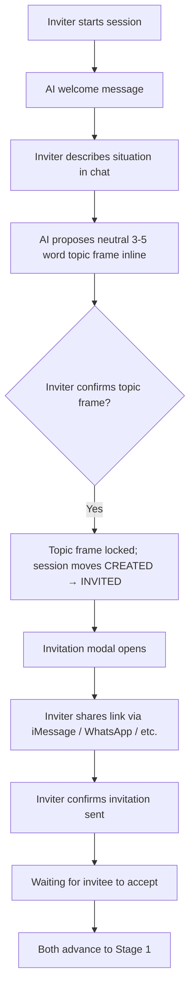
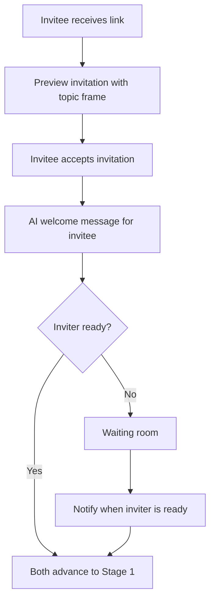
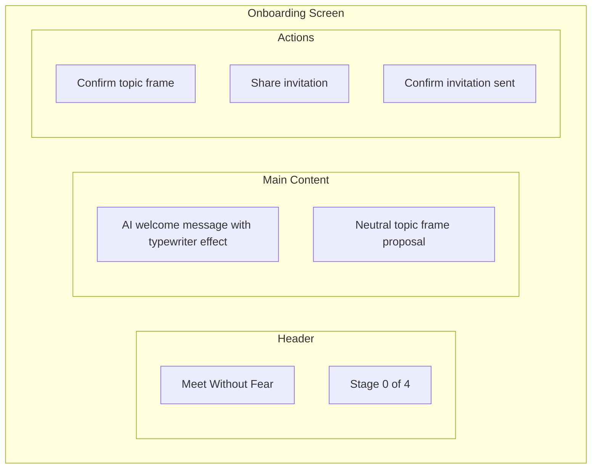

# Stage 0: Onboarding

## Purpose

Welcome the inviter with a brief, warm opening, collaboratively arrive at a neutral topic frame for the conversation, and coordinate the invitation to the other party — before either user enters the structured conversation stages.

## AI Goal

- Briefly explain the private chat format
- Reassure users that nothing is shared without consent
- Propose a neutral 3-5 word topic frame inline (via `<draft>` tag) that captures the situation without blame
- Guide the inviter to confirm the topic frame and then share the invitation with their partner

## Opening Message

The AI opens with a brief, warm message. The message varies based on whether this is the user's first session with this partner:

**First session:**
> "I am here to help you work through conflict — step by step. You'll start by sharing what you believe is happening, privately. I won't share anything you've said unless you explicitly approve it."

**Repeat session:**
> "Welcome back. Same as before — everything stays private unless you approve sharing. Let's pick up where we left off."

This message:
- Speaks in the AI's first person voice
- Sets expectation of a step-by-step process
- Explains the private chat format
- Reassures about consent before sharing

## Flow

The inviter and invitee each have a distinct path through Stage 0.

**Inviter path:**

**Invitee path:**

## Wireframe: Onboarding Screen

## Success Criteria

- Inviter has confirmed the AI-proposed topic frame (`topicFrameConfirmedAt` set on session)
- Invitation is ready to accept (`Invitation.messageConfirmed = true` and session status is `INVITED`)
- Inviter has completed their Stage 0 gate by confirming the invitation/share step
- Invitee has accepted the invitation
- Both users have Stage 0 progress created/completed as appropriate before entering Stage 1

## Failure Paths

| Scenario | AI Response |
|----------|-------------|
| User has concerns | Explore concerns; provide reassurance |
| User refuses to proceed | Explore concerns; explain the format is required; offer resources for other options |
| Other party not responding | Send reminders; offer to resend invitation |
| Invitation expires | Allow session creator to send new invitation |

## Data Captured

- Topic frame text and `topicFrameConfirmedAt` timestamp
- `Invitation.messageConfirmed` flag and `messageConfirmedAt` timestamp
- Stage 0 progress/gates for each participant
- Any concerns raised (for improving onboarding)
- Invitation/acceptance timing

---

## Related Documents

- [User Journey](../overview/user-journey.md)
- [Next: Stage 1 - The Witness](./stage-1-witness.md)

### Backend Implementation

- [Stage 0 API](../backend/api/stage-0.md) - Stage 0 gates and progress endpoints
- [Stage 0 Prompt](../backend/prompts/stage-0-opening.md) - Opening message template
- [Retrieval Contracts](../backend/state-machine/retrieval-contracts.md#stage-0-onboarding)

---

[Back to Stages](./index.md) | [Back to Plans](../index.md)
