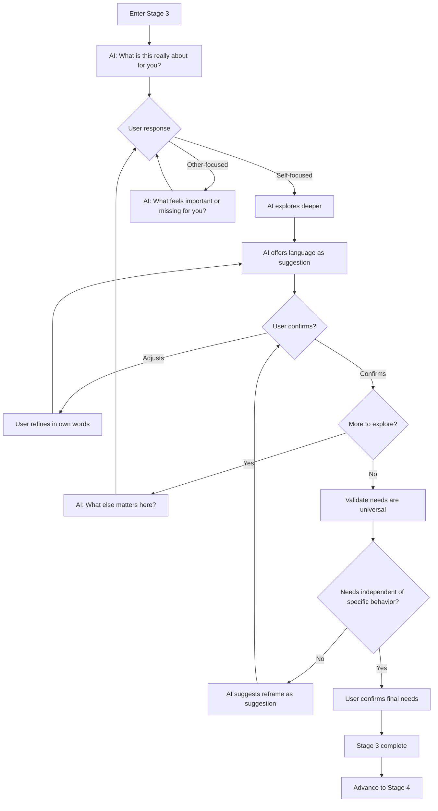
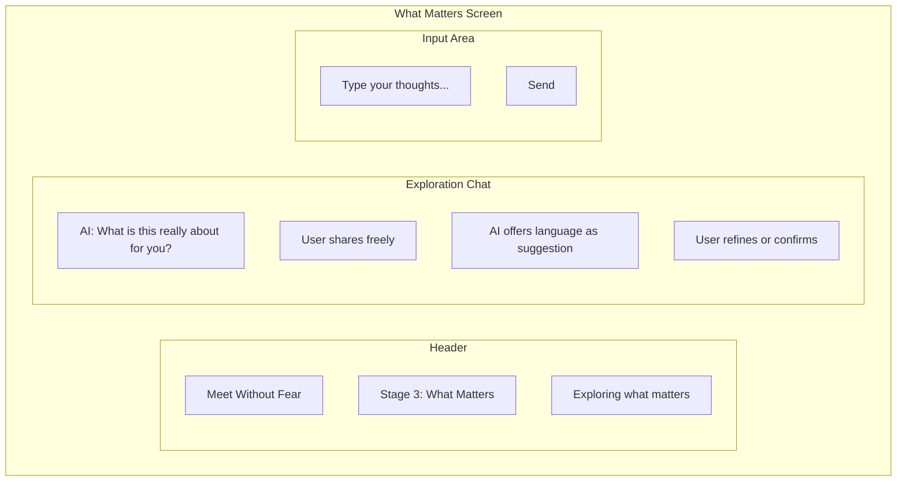

# Stage 3: What Matters

## Purpose

Help each user explore what truly matters to them in the conflict — in terms of their own needs, not what is wrong with the other person.

## AI Goal

- Facilitate **user-driven exploration** of underlying needs
- Redirect other-focused answers back to the user's own experience
- Offer language as suggestions for the user to confirm or refine — never as corrections
- Ensure identified needs are universal and do not depend on a specific person acting a specific way
- Help users move from surface complaints to what genuinely matters

## Opening

The AI opens Stage 3 with:

> "What's this really about for you? Answer in terms of what matters to you — not what's wrong with them."

This framing sets the tone: Stage 3 is about self-exploration, not analysis of the other person.

## Redirect for Other-Focused Answers

When a user answers in terms of what the other person is doing wrong, the AI gently redirects:

> "Let me bring it back to you — what feels important or missing for you?"

The redirect is warm and non-judgmental. The user may need several redirects before shifting from "they always..." to "what matters to me is..."

## Flow



## Key Constraints

### Needs Must Be Universal

A valid need does not depend on a specific person acting a specific way. The AI checks for this:

| Not a universal need | Universal need |
|---------------------|----------------|
| "I need them to stop criticizing me" | "I need acceptance" |
| "I need them to come home earlier" | "I need connection and quality time" |
| "I need them to agree with me" | "I need to feel heard and respected" |

### Language as Suggestion, Not Correction

The AI offers reframes as possibilities, not corrections:

```
User: "I just need them to listen to me for once."

AI: "It sounds like being heard really matters to you. Would you
    say this is about needing to feel that your voice counts —
    or does it feel like something else?"
```

The user always has the final word on what their needs are. The AI suggests; the user decides.

## Universal Needs Framework

The AI maps to universal human needs (aligned with Rosenberg's framework):

| Category | Example Needs |
|----------|---------------|
| **Safety** | Security, stability, predictability, protection |
| **Connection** | Belonging, intimacy, closeness, understanding |
| **Autonomy** | Freedom, choice, independence, self-determination |
| **Recognition** | Appreciation, acknowledgment, respect, being seen |
| **Meaning** | Purpose, contribution, growth, significance |
| **Fairness** | Justice, equality, reciprocity, balance |

## Wireframe: What Matters Interface



## Success Criteria

User has identified at least one universal need in their own words, confirmed by the user (not imposed by the AI).

## Failure Paths

| Scenario | AI Response |
|----------|-------------|
| User stays other-focused | Gentle, repeated redirects back to self |
| User rejects AI suggestion | Accept gracefully; ask user to describe in their own words |
| Accusatory language persists | Redirect to needs; return to Stage 2 if needed |
| User struggles to articulate | Offer multiple framings as possibilities to try on |

## Data Captured

- User's self-described needs (in their own words)
- AI suggestions offered and user responses
- Redirect interactions
- Confirmation of final needs

---

## Related Documents

- [Previous: Stage 2 - Perspective Stretch](./stage-2-perspective-stretch.md)
- [Next: Stage 4 - Strategic Repair](./stage-4-strategic-repair.md)
- [System Guardrails](../mechanisms/guardrails.md)

### Backend Implementation

- [Stage 3 API](../backend/api/stage-3.md) - Need synthesis and common ground endpoints
- [Stage 3 Prompt](../backend/prompts/stage-3-needs.md) - Need mapping prompt template
- [Need Extraction Prompt](../backend/prompts/need-extraction.md) - AI need synthesis
- [Retrieval Contracts](../backend/state-machine/retrieval-contracts.md#stage-3-need-mapping)

---

[Back to Stages](./index.md) | [Back to Plans](../index.md)
