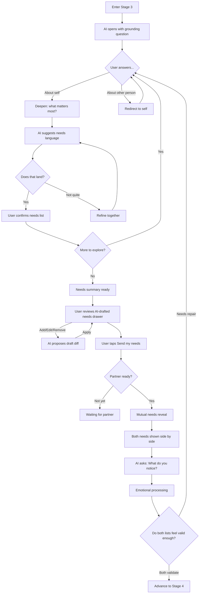

# Stage 3: What Matters

## Purpose

Help each user articulate what truly matters to them in their own words — what they need, what's missing — without framing it in terms of the other person's behavior. The shift is from AI-driven need synthesis to **user-driven exploration**.

## AI Goal

- Open with a direct, grounding question that invites self-reflection
- Redirect the user when they frame needs in terms of the other person
- Translate toward universal human needs, offering language as **suggestion, not correction**
- Ensure needs are expressed independently of a specific person acting a specific way

## Guiding Principles

1. **User-driven**: The user discovers what matters; the AI guides but doesn't synthesize for them
2. **Self-referential needs**: Valid needs don't depend on a specific person acting a specific way
3. **Suggestion, not correction**: AI offers needs language as a possibility, not a reframe
4. **No premature overlap analysis**: The AI does not identify, label, or score overlap; noticing belongs to the users

## Flow

## Opening

The AI opens with a direct, grounding question:

> "When you step back and look at all of this -- what's this really about for you? Answer in terms of what matters to you or what you're missing -- not what's wrong with them."

## Redirection

If the user answers in terms of the other person, the AI redirects gently:

> "I hear that. Let me bring it back to you -- when that happens, what feels important or missing for you?"

## Needs Language

The AI draws on universal human needs as a lens, but offers language as suggestion:

| Category | Example Needs |
|----------|---------------|
| **Safety** | Security, stability, predictability, trust |
| **Connection** | Belonging, intimacy, closeness, understanding |
| **Autonomy** | Freedom, choice, independence, self-determination |
| **Recognition** | Appreciation, acknowledgment, respect, being seen |
| **Meaning** | Purpose, contribution, growth, significance |
| **Fairness** | Justice, equality, reciprocity, balance |

Example exchange:
- User: "They never help with anything around the house."
- AI redirect: "I hear that. Let me bring it back to you -- when that happens, what feels important or missing for you?"
- User: "I guess I just want to feel like we're a team."
- AI: "Partnership. Like you need to feel like you're in this together. Does that land?"

## Needs Review Drawer

After the AI has helped draft needs language, the user reviews a focused "Your needs" drawer before anything is shared. Needs remain an AI-owned draft list until the user explicitly sends them.

The drawer supports:
- **Add need**: the user describes what is missing; the AI proposes a need card; the user previews and accepts before it is saved.
- **Edit / Ask AI to reword**: the user gives instructions about what feels wrong; the backend interprets a structured edit plan; the UI shows before/after diffs; only "Apply" mutates the list.
- **Remove**: the user can remove their own needs before sharing.
- **Send my needs**: the separate consent moment that shares confirmed needs through the existing Stage 3 boundary.

Needs that appear blame-shaped, strategy-shaped, or other-person-focused are preserved but flagged for review. The app invites the user to reword them toward universal self-referential needs instead of silently correcting them.

Once `needsShared` is set, direct add/edit/remove is locked. Later corrections require an explicit follow-up correction path rather than mutating already-shared needs.

## Mutual Needs Reveal

After both users complete their needs exploration:

1. **Hold**: Both confirmed needs lists are held until both users finish Stage 3
2. **Consent**: Each user consents to share (same pattern as Stage 2 empathy consent)
3. **Reveal**: Both needs shown side by side
4. **Minimal framing**: AI says something brief, then asks: **"What do you notice?"**
5. **Emotional processing**: AI helps users name what it is like to see both lists without interpreting the relationship for them
6. **Continue**: Once both users have sent needs, Stage 4 can begin; there is no second accuracy confirmation for the other person's needs
7. **No interpretation**: AI does not frame needs as compatible, overlapping, complementary, or shared -- that seeing belongs to the users

## Success Criteria

Each user has articulated what matters to them in needs language that doesn't depend on the other person acting a specific way. Both users have confirmed and sent their own needs, seen the side-by-side reveal, and are ready to carry those needs into Stage 4.

## Failure Paths

| Scenario | AI Response |
|----------|-------------|
| User keeps framing in terms of other person | Redirect gently: "When that happens, what feels important or missing for you?" |
| User struggles to name needs | Offer suggestions: "Could it be something like safety? Or maybe feeling seen?" |
| User says "I don't know" | Widen the lens: "If things were the way you wanted, what would be different for you?" |
| Accusatory language persists | Validate the feeling, redirect to self: "That sounds really frustrating. What's underneath that for you?" |

## Data Captured

- Identified needs for each user (user-driven, AI-suggested)
- Confirmation records for each user's needs list
- Consent records for needs sharing
- Mutual needs reveal timestamp
- Needs validation records for the Stage 3 gate

---

## Related Documents

- [Previous: Stage 2 - Perspective Stretch](./stage-2-perspective-stretch.md)
- [Next: Stage 4 - Strategic Repair](./stage-4-strategic-repair.md)
- [System Guardrails](../mechanisms/guardrails.md)

### Backend Implementation

- [Stage 3 API](../../backend/api/stage-3.md) - Needs exploration and sharing endpoints
- [Retrieval Contracts](../../backend/state-machine/retrieval-contracts.md#stage-3-what-matters)

---

[Back to Stages](./index.md) | [Back to Plans](../index.md)
