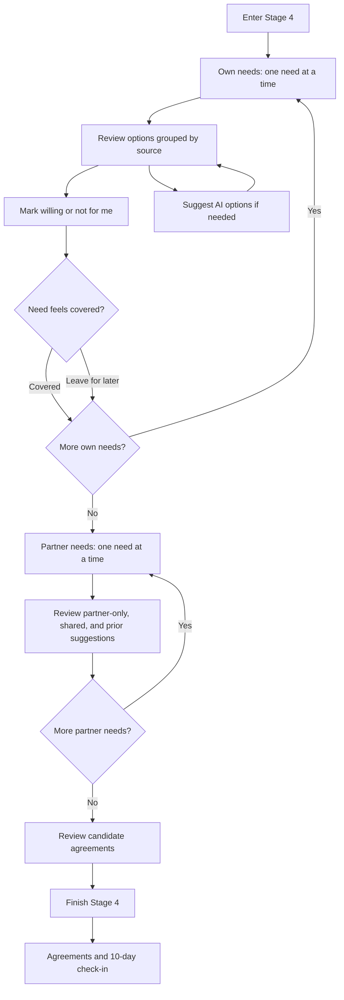
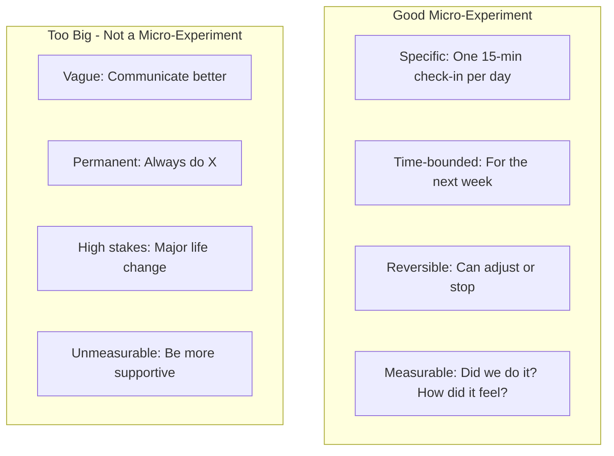
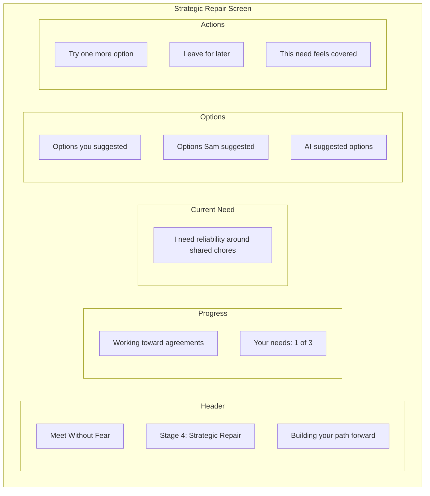
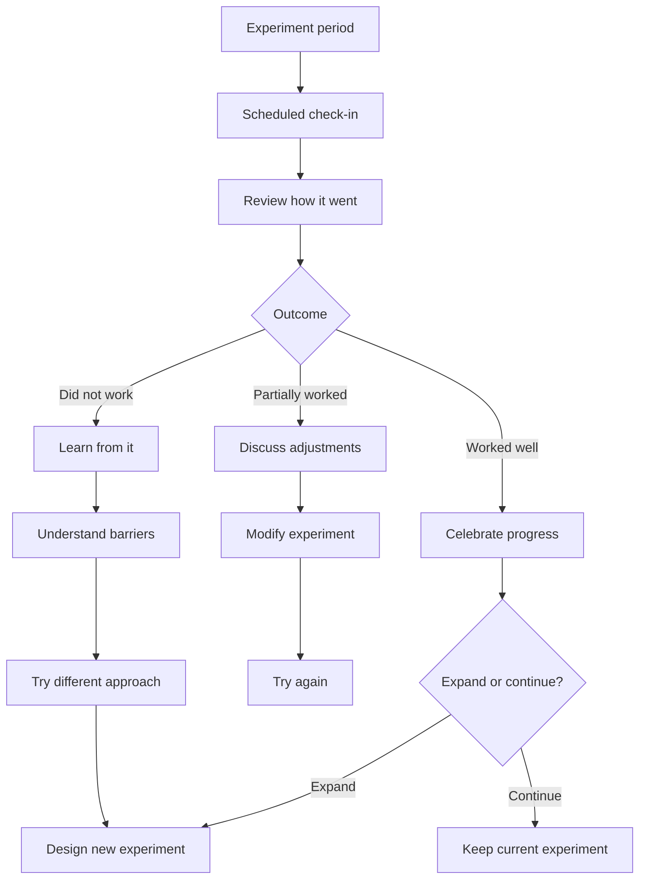

# Stage 4: Strategic Repair

:::tip See it in action
<a href="/demo/features/follow-up.html" onClick="window.location.href='/demo/features/follow-up.html'; return false;">Try the Follow-up Check-in demo</a> - Experience the post-agreement check-in that ensures accountability.
:::

## Purpose

Move from understanding to action by designing small, reversible experiments that address identified needs.

## AI Goal

- Walk each user through one need at a time, starting with their own needs and then the partner's needs
- Show options in context with explicit source labels: current user, partner, or AI
- Help refine proposals to be small, reversible, time-bounded, and observable
- Let users mark willingness proposal by proposal without treating chat text as a stage-advancing command
- Ask whether each need feels sufficiently addressed, with covered/skipped state persisted per user
- Offer AI-suggested options for needs that have no useful proposals, using confirmed needs and curated global library items only
- End with a quality review of candidate agreements and a default check-in about 10 days later

## Key Design: Focused Need Walkthrough

Stage 4 is a guided walkthrough, not a giant strategy dashboard. The app starts with the current user's first need, shows options for that need, records willingness, then asks whether that need feels covered.

Default order:
1. Current user's own needs
2. Partner needs relevant to the current user
3. Quality review
4. Close and summary

Each option carries quiet source metadata:
- **You suggested**: originated from the current user's side
- **Partner suggested**: originated from the partner's side
- **AI suggested**: generated by the Stage 4 suggestion endpoint

## Flow



## Micro-Experiment Design

The AI helps users design experiments that are:



## Example Micro-Experiments

| Need Addressed | Micro-Experiment |
|----------------|------------------|
| Connection | "We will have a 10-minute phone-free conversation at dinner for 5 days" |
| Recognition | "I will say one specific thing I appreciate each morning for a week" |
| Safety | "We will use a pause signal when conversations get heated and take 5 minutes" |
| Fairness | "We will alternate who chooses weekend activities for the next month" |

## When No Shared Agreement Exists

If there is no mutually willing shared proposal, Stage 4 can still close honestly. Individual commitments and named open needs are valid outcomes. The close record preserves individual commitments, open needs, and the 10-day check-in date where applicable.

## Wireframe: Strategic Repair Interface

### Focused Need View



### Quality Review View

```mermaid
flowchart TB
    subgraph Screen[Review Agreements]
        Agreement[Candidate agreement card]
        Warning[Warning if vague or hard to check]
        CheckIn[Default check-in: 10 days]
        Finish[Finish Stage 4]
    end
```



**Key visual elements:**
- The main surface shows one need at a time
- A compact "View all" review list shows own and partner needs with statuses
- Source labels are visible but quiet
- Weak agreement warnings are visible and non-blocking
- The follow-up/check-in date defaults to about 10 days

## Success Criteria

Users leave with one or more mutually willing micro-experiments, individual commitments, or a clearly named no-shared-agreement outcome. The result includes a checkable summary and a 10-day follow-up date.

## Agreement Documentation

When users agree, the AI documents:

```
MICRO-EXPERIMENT AGREEMENT
--------------------------
Participants: [User A], [User B]
Date agreed: [Date]

Experiment: [Specific description]
Duration: [Time period]
Success measure: [How to know if it worked]

Check-in scheduled: [Date/time if applicable]
```

## Failure Paths

| Scenario | AI Response |
|----------|-------------|
| No proposals generated | AI suggests options based on identified needs |
| Repeated rejection | Explore what would work; may need to return to what matters |
| Proposals too ambitious | Help scope down; emphasize "small and reversible" |
| One party uncooperative | Acknowledge difficulty; explore barriers |

## Follow-Up Support

If users schedule a check-in:



## Data Captured

- Proposals made
- Negotiation history
- Agreed experiments
- Follow-up schedules
- Check-in outcomes (if applicable)

---

## Related Documents

- [Previous: Stage 3 - What Matters](./stage-3-what-matters.md)
- [User Journey](../overview/user-journey.md)
- [System Guardrails](../mechanisms/guardrails.md)

### Backend Implementation

- [Stage 4 API](../backend/api/stage-4.md) - Strategy and agreement endpoints
- [Stage 4 Prompt](../backend/prompts/stage-4-repair.md) - Strategic repair prompt template
- [Retrieval Contracts](../backend/state-machine/retrieval-contracts.md#stage-4-strategic-repair)
- [Global Library Schema](../backend/data-model/prisma-schema.md#global-library-stage-4-suggestions)

---

[Back to Stages](./index.md) | [Back to Plans](../index.md)
