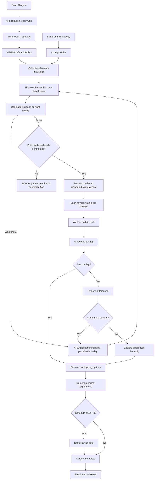
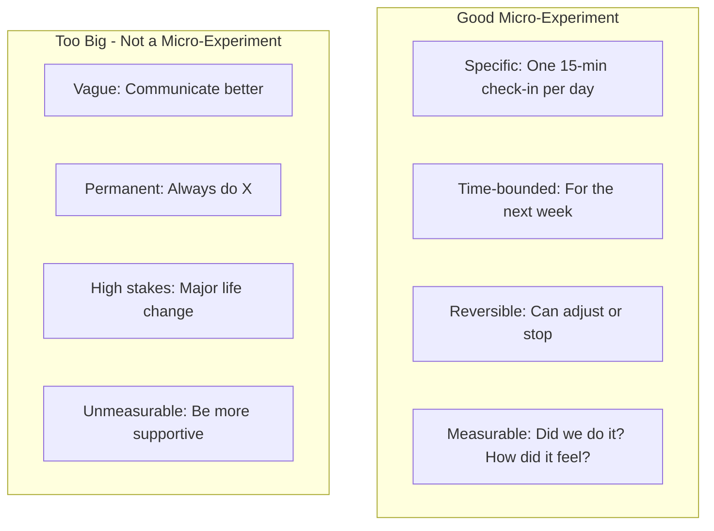
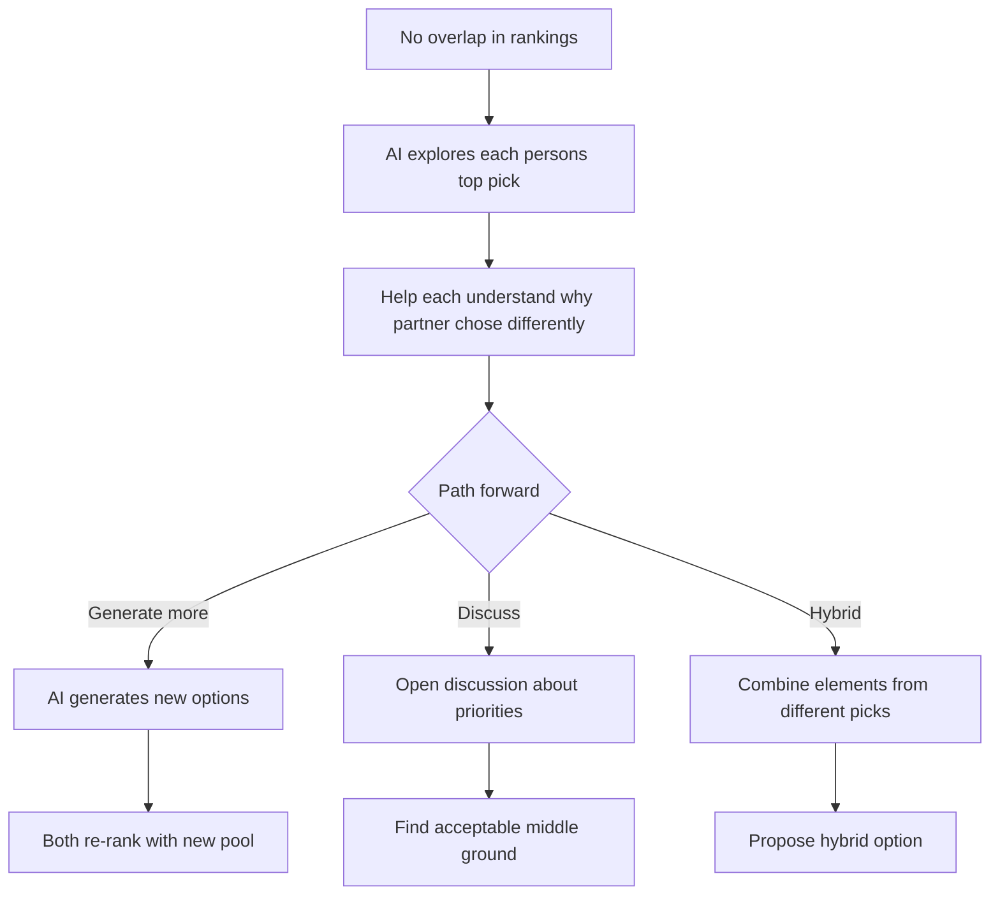
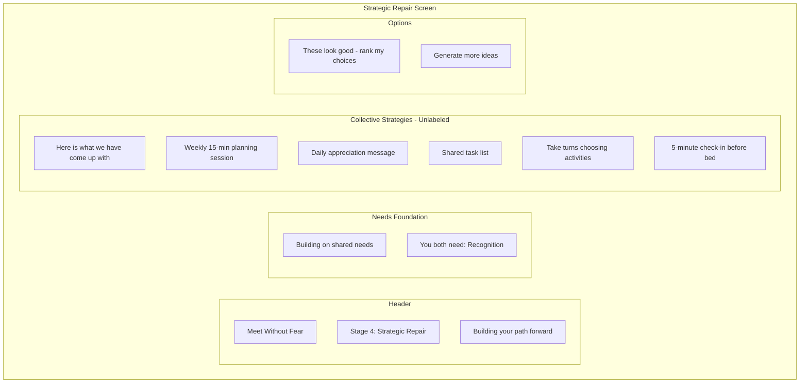
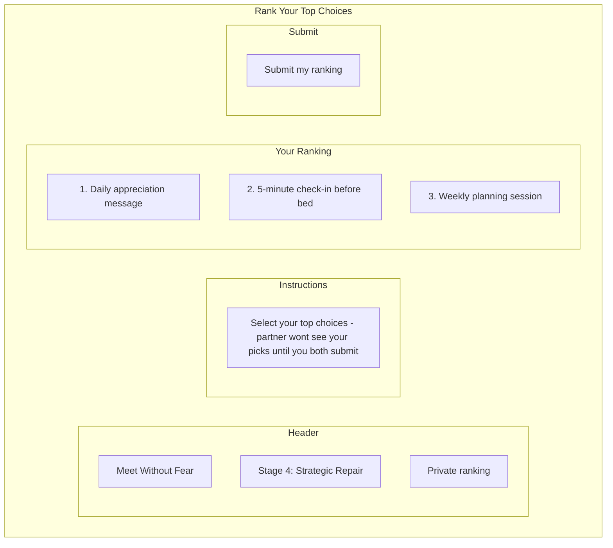
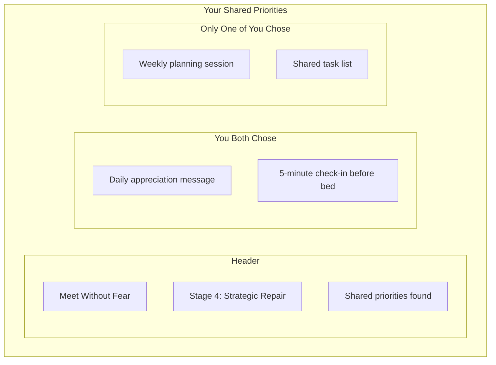
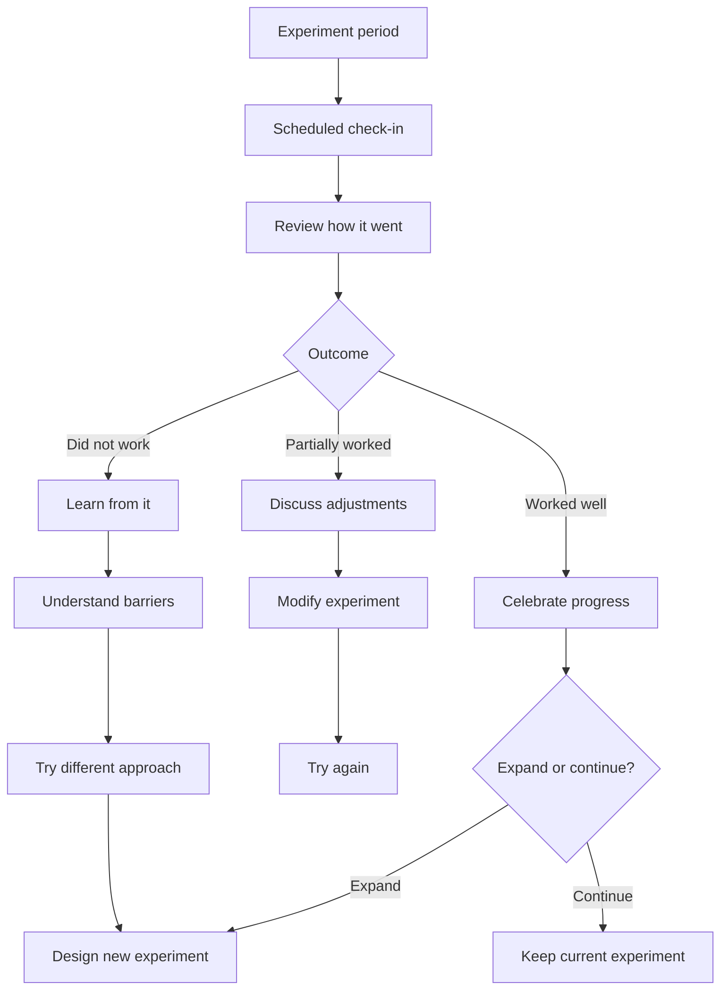

# Stage 4: Strategic Repair

:::tip See it in action
<a href="/demo/features/follow-up.html" onClick="window.location.href='/demo/features/follow-up.html'; return false;">Try the Follow-up Check-in demo</a> - Experience the post-agreement check-in that ensures accountability.
:::

## Purpose

Move from understanding to action by designing small, reversible experiments that address identified needs.

## AI Goal

- Invite **both users** to propose their own strategies
- Help refine proposals to be small, reversible, and time-bounded
- Collect and combine suggestions from both parties
- During collection, keep each person's proposed strategies visible only to that person
- Present all strategies as **unlabeled options** only once both users are ready to rank and each has contributed
- Allow users to select from the combined pool
- Offer to generate additional AI suggestions if desired (product target; the current backend endpoint is still a placeholder)
- Document agreed-upon micro-experiments

## Key Design: Collaborative Strategy Generation

Unlike traditional negotiation where one person proposes and the other reacts, Stage 4 invites **both parties to contribute strategies independently**. The AI then:

1. Collects strategies from both users
2. Shows each user only their own ideas while collection is still in progress
3. Lets each user mark "Done Adding Ideas" after they have contributed at least one strategy
4. Presents the combined list as a single unlabeled pool once both users are ready
5. Each person **privately ranks their top choices**
6. AI reveals where selections overlap

This approach:
- Removes defensiveness that comes with accepting another's proposal
- Creates joint ownership of solutions
- Prevents one person from being asked to rank a partner-only set of ideas
- Avoids win/lose dynamics
- Encourages creativity when users can build on unlabeled ideas
- Private ranking removes pressure of visible negotiation
- Overlap emerges naturally without either person feeling like they gave in

## Flow



## Micro-Experiment Design

The AI helps users design experiments that are:



## Example Micro-Experiments

| Need Addressed | Micro-Experiment |
|----------------|------------------|
| Connection | "We will have a 10-minute phone-free conversation at dinner for 5 days" |
| Recognition | "I will say one specific thing I appreciate each morning for a week" |
| Safety | "We will use a pause signal when conversations get heated and take 5 minutes" |
| Fairness | "We will alternate who chooses weekend activities for the next month" |

## When No Overlap Exists

If private rankings reveal no overlap, the backend returns each user's top-ranked strategy as agreement candidates so the UI can keep the conversation moving:



## Wireframe: Strategic Repair Interface

### Strategy Pool View



### Collection View

Before the shared pool opens, the user sees only ideas created from their side of the Stage 4 conversation. The primary action is **Done Adding Ideas**, not **Ready to Rank**. This marks the caller's readiness gate and waits for the partner if the combined pool is not ready yet.

### Private Ranking View



### Overlap Reveal View



**Key visual elements:**
- During collection, users see only their own saved ideas
- Once ranking is available, strategy options are presented without labels indicating who suggested them
- All buttons use soft, neutral colors (no "yours" vs "theirs" styling)
- Ranking is private until both submit
- Overlap is revealed together without implying agreement where none exists

## Success Criteria

Mutual agreement on at least one micro-experiment.

## Agreement Documentation

When users agree, the AI documents:

```
MICRO-EXPERIMENT AGREEMENT
--------------------------
Participants: [User A], [User B]
Date agreed: [Date]

Experiment: [Specific description]
Duration: [Time period]
Success measure: [How to know if it worked]

Check-in scheduled: [Date/time if applicable]
```

## Failure Paths

| Scenario | AI Response |
|----------|-------------|
| No proposals generated | AI suggests options based on identified needs |
| Repeated rejection | Explore what would work; may need to return to what matters |
| Proposals too ambitious | Help scope down; emphasize "small and reversible" |
| One party uncooperative | Acknowledge difficulty; explore barriers |

## Follow-Up Support

If users schedule a check-in:



## Data Captured

- Proposals made
- Negotiation history
- Agreed experiments
- Follow-up schedules
- Check-in outcomes (if applicable)

---

## Related Documents

- [Previous: Stage 3 - What Matters](./stage-3-what-matters.md)
- [User Journey](../overview/user-journey.md)
- [System Guardrails](../mechanisms/guardrails.md)

### Backend Implementation

- [Stage 4 API](../backend/api/stage-4.md) - Strategy and agreement endpoints
- [Stage 4 Prompt](../backend/prompts/stage-4-repair.md) - Strategic repair prompt template
- [Retrieval Contracts](../backend/state-machine/retrieval-contracts.md#stage-4-strategic-repair)
- [Global Library Schema](../backend/data-model/prisma-schema.md#global-library-stage-4-suggestions)

---

[Back to Stages](./index.md) | [Back to Plans](../index.md)
