# Reconciler Outcome Paths - State Diagrams

This document provides state diagrams for all reconciler outcome paths from both user perspectives (guesser and subject). These diagrams document the complete flow for PROCEED, OFFER_OPTIONAL, OFFER_SHARING, refinement loops, accuracy feedback, and acceptance checks.

## 1. PROCEED Path (No Gaps Found)

When the reconciler finds no significant gaps between the guesser's empathy attempt and the subject's actual feelings, both users proceed directly to mutual reveal.

### 1.1 Guesser Perspective (PROCEED)

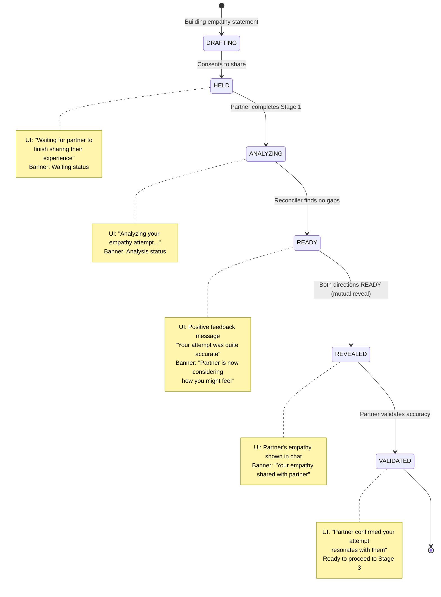
```mermaid
stateDiagram-v2
    [*] --> DRAFTING: Building empathy statement

    DRAFTING --> HELD: Consents to share
    note right of HELD
        UI: "Waiting for partner to<br/>finish sharing their experience"
        Banner: Waiting status
    end note

    HELD --> ANALYZING: Partner completes Stage 1
    note right of ANALYZING
        UI: "Analyzing your empathy attempt..."
        Banner: Analysis status
    end note

    ANALYZING --> READY: Reconciler finds no gaps
    note right of READY
        UI: Positive feedback message<br/>"Your attempt was quite accurate"
        Banner: "Partner is now considering<br/>how you might feel"
    end note

    READY --> REVEALED: Both directions READY (mutual reveal)
    note right of REVEALED
        UI: Partner's empathy shown in chat
        Banner: "Your empathy shared with partner"
    end note

    REVEALED --> VALIDATED: Partner validates accuracy
    note right of VALIDATED
        UI: "Partner confirmed your attempt<br/>resonates with them"
        Ready to proceed to Stage 3
    end note

    VALIDATED --> [*]
```

### 1.2 Subject Perspective (PROCEED)

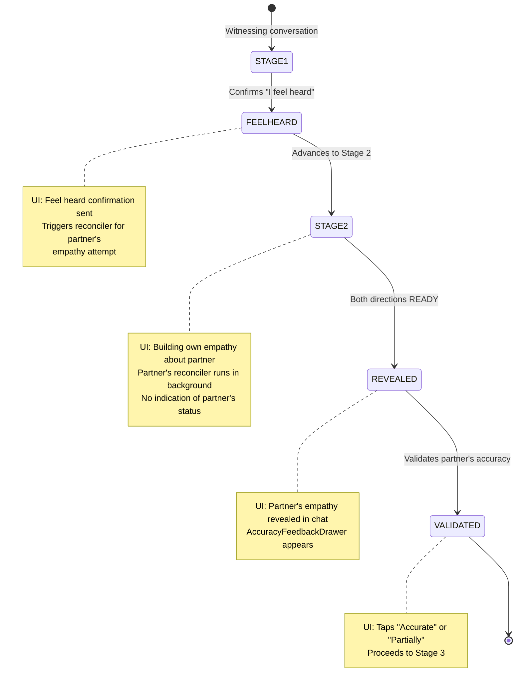
```mermaid
stateDiagram-v2
    [*] --> STAGE1: Witnessing conversation

    STAGE1 --> FEELHEARD: Confirms "I feel heard"
    note right of FEELHEARD
        UI: Feel heard confirmation sent
        Triggers reconciler for partner's<br/>empathy attempt
    end note

    FEELHEARD --> STAGE2: Advances to Stage 2
    note right of STAGE2
        UI: Building own empathy about partner
        Partner's reconciler runs in background
        No indication of partner's status
    end note

    STAGE2 --> REVEALED: Both directions READY
    note right of REVEALED
        UI: Partner's empathy revealed in chat
        AccuracyFeedbackDrawer appears
    end note

    REVEALED --> VALIDATED: Validates partner's accuracy
    note right of VALIDATED
        UI: Taps "Accurate" or "Partially"
        Proceeds to Stage 3
    end note

    VALIDATED --> [*]
```

## 2. OFFER_OPTIONAL Path (Moderate Gaps)

When the reconciler detects moderate gaps, it suggests the subject MIGHT CONSIDER sharing additional context using soft language and blue styling.

### 2.1 Guesser Perspective (OFFER_OPTIONAL)

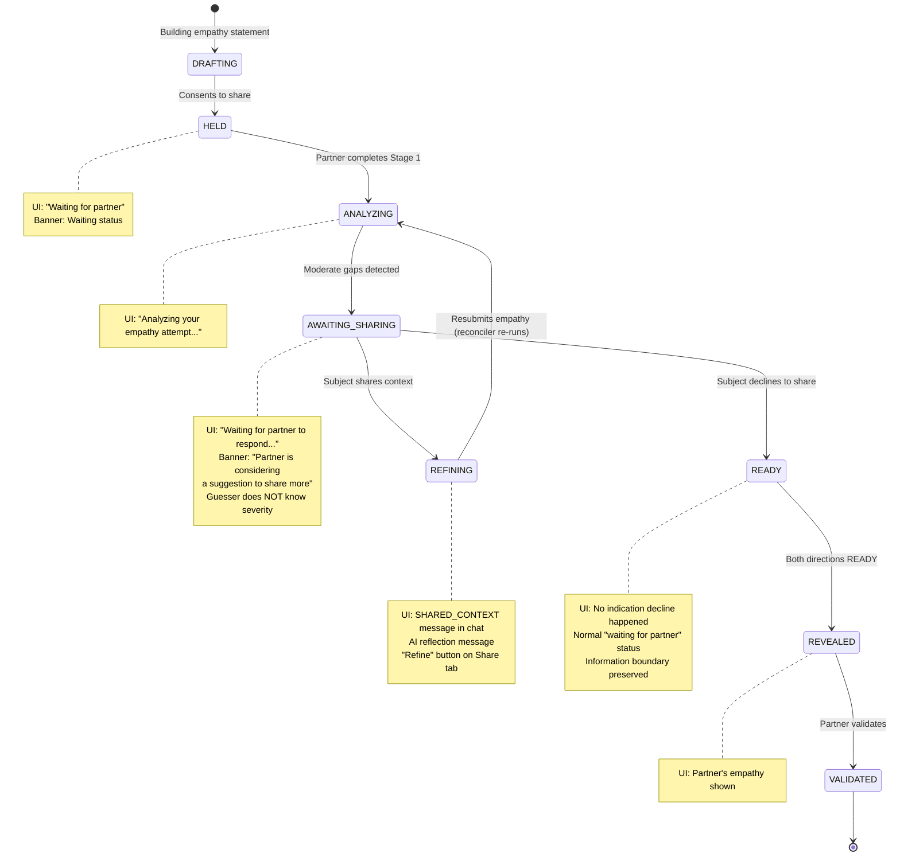
```mermaid
stateDiagram-v2
    [*] --> DRAFTING: Building empathy statement

    DRAFTING --> HELD: Consents to share
    note right of HELD
        UI: "Waiting for partner"
        Banner: Waiting status
    end note

    HELD --> ANALYZING: Partner completes Stage 1
    note right of ANALYZING
        UI: "Analyzing your empathy attempt..."
    end note

    ANALYZING --> AWAITING_SHARING: Moderate gaps detected
    note right of AWAITING_SHARING
        UI: "Waiting for partner to respond..."
        Banner: "Partner is considering<br/>a suggestion to share more"
        Guesser does NOT know severity
    end note

    AWAITING_SHARING --> REFINING: Subject shares context
    note right of REFINING
        UI: SHARED_CONTEXT message in chat<br/>AI reflection message<br/>"Refine" button on Share tab
    end note

    AWAITING_SHARING --> READY: Subject declines to share
    note right of READY
        UI: No indication decline happened<br/>Normal "waiting for partner" status
        Information boundary preserved
    end note

    REFINING --> ANALYZING: Resubmits empathy (reconciler re-runs)

    READY --> REVEALED: Both directions READY
    note right of REVEALED
        UI: Partner's empathy shown
    end note

    REVEALED --> VALIDATED: Partner validates

    VALIDATED --> [*]
```

### 2.2 Subject Perspective (OFFER_OPTIONAL)

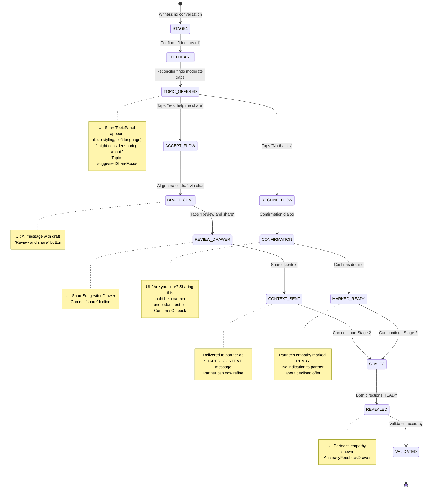
```mermaid
stateDiagram-v2
    [*] --> STAGE1: Witnessing conversation

    STAGE1 --> FEELHEARD: Confirms "I feel heard"

    FEELHEARD --> TOPIC_OFFERED: Reconciler finds moderate gaps
    note right of TOPIC_OFFERED
        UI: ShareTopicPanel appears<br/>(blue styling, soft language)<br/>"might consider sharing about:"<br/>Topic: suggestedShareFocus
    end note

    TOPIC_OFFERED --> ACCEPT_FLOW: Taps "Yes, help me share"
    TOPIC_OFFERED --> DECLINE_FLOW: Taps "No thanks"

    ACCEPT_FLOW --> DRAFT_CHAT: AI generates draft via chat
    note right of DRAFT_CHAT
        UI: AI message with draft<br/>"Review and share" button
    end note

    DRAFT_CHAT --> REVIEW_DRAWER: Taps "Review and share"
    note right of REVIEW_DRAWER
        UI: ShareSuggestionDrawer<br/>Can edit/share/decline
    end note

    REVIEW_DRAWER --> CONTEXT_SENT: Shares context
    note right of CONTEXT_SENT
        Delivered to partner as<br/>SHARED_CONTEXT message<br/>Partner can now refine
    end note

    DECLINE_FLOW --> CONFIRMATION: Confirmation dialog
    note right of CONFIRMATION
        UI: "Are you sure? Sharing this<br/>could help partner understand better"
        Confirm / Go back
    end note

    CONFIRMATION --> MARKED_READY: Confirms decline
    note right of MARKED_READY
        Partner's empathy marked READY<br/>No indication to partner<br/>about declined offer
    end note

    CONTEXT_SENT --> STAGE2: Can continue Stage 2
    MARKED_READY --> STAGE2: Can continue Stage 2

    STAGE2 --> REVEALED: Both directions READY
    note right of REVEALED
        UI: Partner's empathy shown<br/>AccuracyFeedbackDrawer
    end note

    REVEALED --> VALIDATED: Validates accuracy

    VALIDATED --> [*]
```

## 3. OFFER_SHARING Path (Significant Gaps)

When the reconciler detects significant gaps, it strongly suggests the subject share additional context using strong language and orange/amber styling.

### 3.1 Guesser Perspective (OFFER_SHARING)

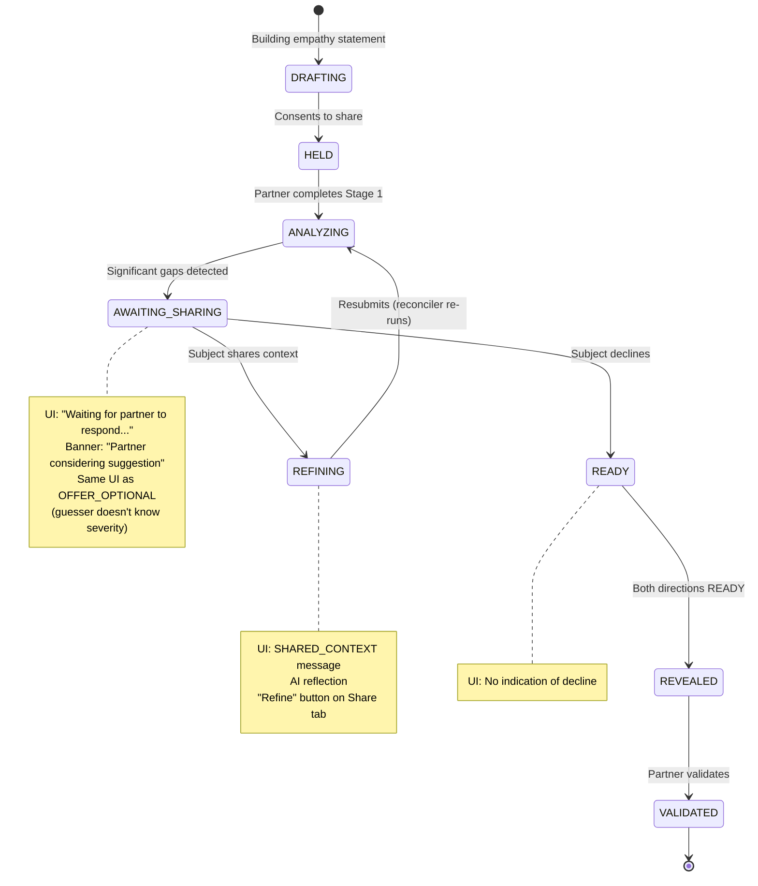
```mermaid
stateDiagram-v2
    [*] --> DRAFTING: Building empathy statement

    DRAFTING --> HELD: Consents to share

    HELD --> ANALYZING: Partner completes Stage 1

    ANALYZING --> AWAITING_SHARING: Significant gaps detected
    note right of AWAITING_SHARING
        UI: "Waiting for partner to respond..."
        Banner: "Partner considering suggestion"
        Same UI as OFFER_OPTIONAL<br/>(guesser doesn't know severity)
    end note

    AWAITING_SHARING --> REFINING: Subject shares context
    note right of REFINING
        UI: SHARED_CONTEXT message<br/>AI reflection<br/>"Refine" button on Share tab
    end note

    AWAITING_SHARING --> READY: Subject declines
    note right of READY
        UI: No indication of decline
    end note

    REFINING --> ANALYZING: Resubmits (reconciler re-runs)

    READY --> REVEALED: Both directions READY

    REVEALED --> VALIDATED: Partner validates

    VALIDATED --> [*]
```

### 3.2 Subject Perspective (OFFER_SHARING)

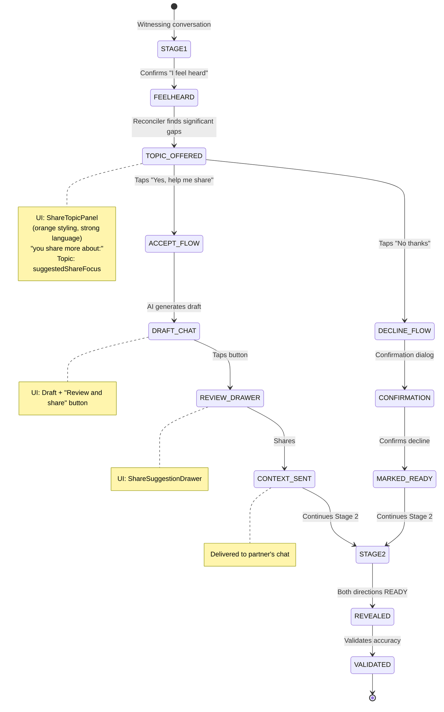
```mermaid
stateDiagram-v2
    [*] --> STAGE1: Witnessing conversation

    STAGE1 --> FEELHEARD: Confirms "I feel heard"

    FEELHEARD --> TOPIC_OFFERED: Reconciler finds significant gaps
    note right of TOPIC_OFFERED
        UI: ShareTopicPanel<br/>(orange styling, strong language)<br/>"you share more about:"<br/>Topic: suggestedShareFocus
    end note

    TOPIC_OFFERED --> ACCEPT_FLOW: Taps "Yes, help me share"
    TOPIC_OFFERED --> DECLINE_FLOW: Taps "No thanks"

    ACCEPT_FLOW --> DRAFT_CHAT: AI generates draft
    note right of DRAFT_CHAT
        UI: Draft + "Review and share" button
    end note

    DRAFT_CHAT --> REVIEW_DRAWER: Taps button
    note right of REVIEW_DRAWER
        UI: ShareSuggestionDrawer
    end note

    REVIEW_DRAWER --> CONTEXT_SENT: Shares
    note right of CONTEXT_SENT
        Delivered to partner's chat
    end note

    DECLINE_FLOW --> CONFIRMATION: Confirmation dialog

    CONFIRMATION --> MARKED_READY: Confirms decline

    CONTEXT_SENT --> STAGE2: Continues Stage 2
    MARKED_READY --> STAGE2: Continues Stage 2

    STAGE2 --> REVEALED: Both directions READY

    REVEALED --> VALIDATED: Validates accuracy

    VALIDATED --> [*]
```

## 4. Refinement Loop (One Cycle)

When the subject shares additional context, the guesser can refine their empathy attempt. The reconciler re-runs once. Per design constraints, only one refinement cycle is supported.

### 4.1 Guesser Perspective (Refinement)

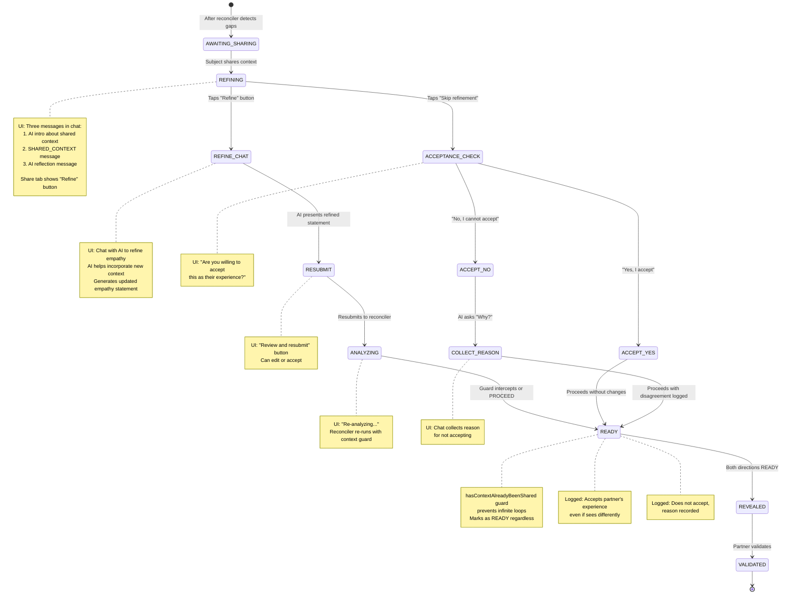
```mermaid
stateDiagram-v2
    [*] --> AWAITING_SHARING: After reconciler detects gaps

    AWAITING_SHARING --> REFINING: Subject shares context
    note right of REFINING
        UI: Three messages in chat:<br/>1. AI intro about shared context<br/>2. SHARED_CONTEXT message<br/>3. AI reflection message<br/><br/>Share tab shows "Refine" button
    end note

    REFINING --> REFINE_CHAT: Taps "Refine" button
    note right of REFINE_CHAT
        UI: Chat with AI to refine empathy<br/>AI helps incorporate new context<br/>Generates updated empathy statement
    end note

    REFINE_CHAT --> RESUBMIT: AI presents refined statement
    note right of RESUBMIT
        UI: "Review and resubmit" button<br/>Can edit or accept
    end note

    RESUBMIT --> ANALYZING: Resubmits to reconciler
    note right of ANALYZING
        UI: "Re-analyzing..."<br/>Reconciler re-runs with context guard
    end note

    ANALYZING --> READY: Guard intercepts or PROCEED
    note right of READY
        hasContextAlreadyBeenShared guard<br/>prevents infinite loops<br/>Marks as READY regardless
    end note

    REFINING --> ACCEPTANCE_CHECK: Taps "Skip refinement"
    note right of ACCEPTANCE_CHECK
        UI: "Are you willing to accept<br/>this as their experience?"
    end note

    ACCEPTANCE_CHECK --> ACCEPT_YES: "Yes, I accept"
    ACCEPTANCE_CHECK --> ACCEPT_NO: "No, I cannot accept"

    ACCEPT_YES --> READY: Proceeds without changes
    note right of READY
        Logged: Accepts partner's experience<br/>even if sees differently
    end note

    ACCEPT_NO --> COLLECT_REASON: AI asks "Why?"
    note right of COLLECT_REASON
        UI: Chat collects reason<br/>for not accepting
    end note

    COLLECT_REASON --> READY: Proceeds with disagreement logged
    note right of READY
        Logged: Does not accept,<br/>reason recorded
    end note

    READY --> REVEALED: Both directions READY

    REVEALED --> VALIDATED: Partner validates

    VALIDATED --> [*]
```

### 4.2 Subject Perspective (Refinement)

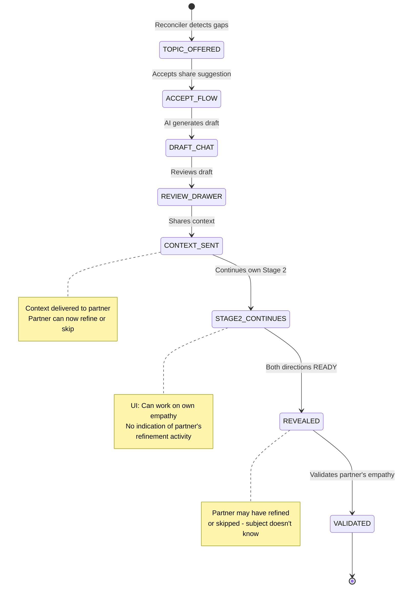
```mermaid
stateDiagram-v2
    [*] --> TOPIC_OFFERED: Reconciler detects gaps

    TOPIC_OFFERED --> ACCEPT_FLOW: Accepts share suggestion

    ACCEPT_FLOW --> DRAFT_CHAT: AI generates draft

    DRAFT_CHAT --> REVIEW_DRAWER: Reviews draft

    REVIEW_DRAWER --> CONTEXT_SENT: Shares context
    note right of CONTEXT_SENT
        Context delivered to partner<br/>Partner can now refine or skip
    end note

    CONTEXT_SENT --> STAGE2_CONTINUES: Continues own Stage 2
    note right of STAGE2_CONTINUES
        UI: Can work on own empathy<br/>No indication of partner's<br/>refinement activity
    end note

    STAGE2_CONTINUES --> REVEALED: Both directions READY
    note right of REVEALED
        Partner may have refined<br/>or skipped - subject doesn't know
    end note

    REVEALED --> VALIDATED: Validates partner's empathy

    VALIDATED --> [*]
```

## 5. Accuracy Feedback Paths (Post-Reveal)

After mutual reveal, the subject validates the guesser's empathy attempt. There are three paths based on accuracy rating.

### 5.1 Subject Perspective (Accurate Feedback)

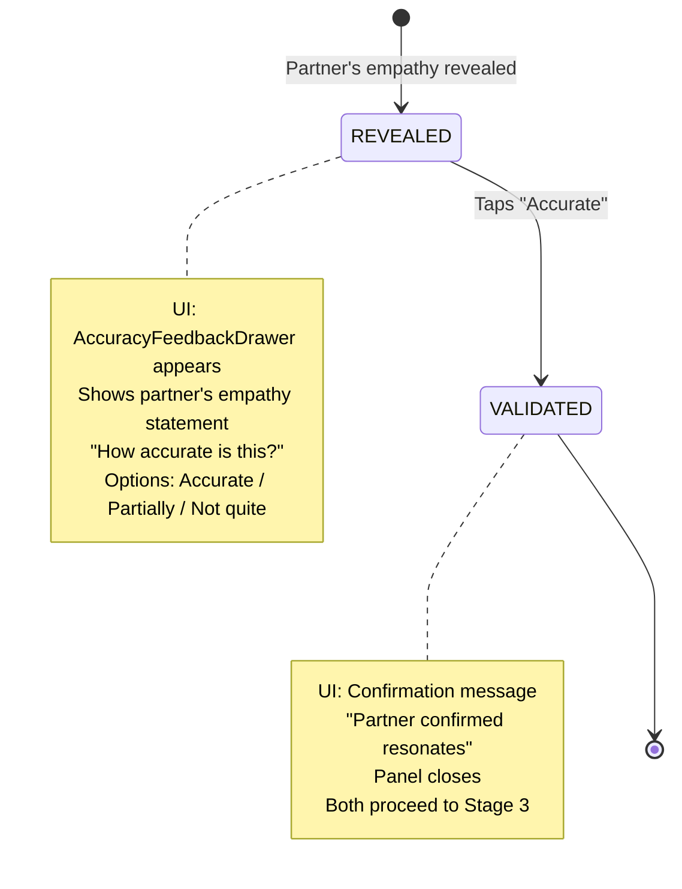
```mermaid
stateDiagram-v2
    [*] --> REVEALED: Partner's empathy revealed
    note right of REVEALED
        UI: AccuracyFeedbackDrawer appears<br/>Shows partner's empathy statement<br/>"How accurate is this?"<br/>Options: Accurate / Partially / Not quite
    end note

    REVEALED --> VALIDATED: Taps "Accurate"
    note right of VALIDATED
        UI: Confirmation message<br/>"Partner confirmed resonates"<br/>Panel closes<br/>Both proceed to Stage 3
    end note

    VALIDATED --> [*]
```

### 5.2 Subject Perspective (Partially Accurate Feedback)

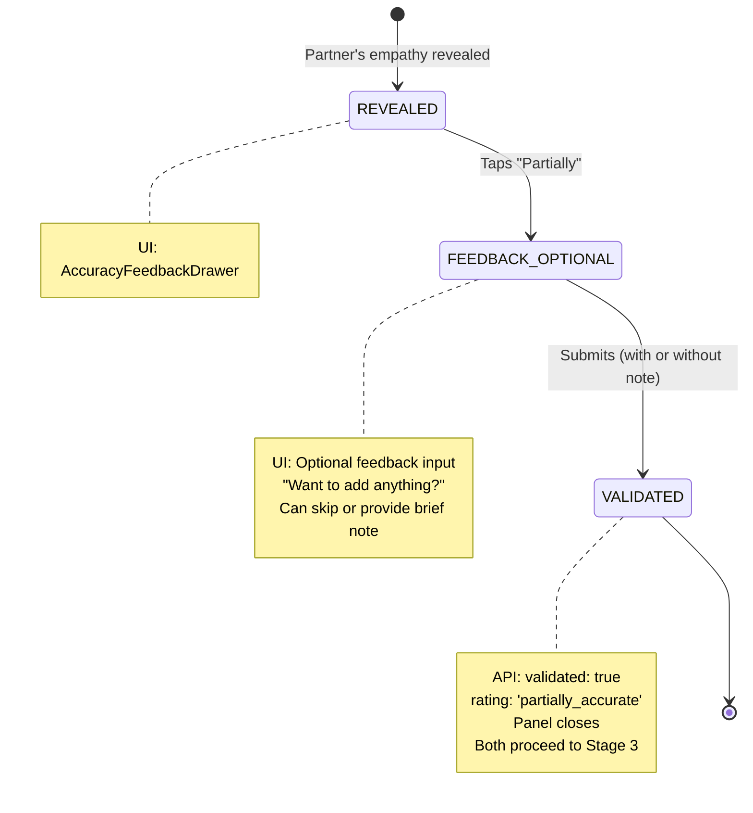
```mermaid
stateDiagram-v2
    [*] --> REVEALED: Partner's empathy revealed
    note right of REVEALED
        UI: AccuracyFeedbackDrawer
    end note

    REVEALED --> FEEDBACK_OPTIONAL: Taps "Partially"
    note right of FEEDBACK_OPTIONAL
        UI: Optional feedback input<br/>"Want to add anything?"<br/>Can skip or provide brief note
    end note

    FEEDBACK_OPTIONAL --> VALIDATED: Submits (with or without note)
    note right of VALIDATED
        API: validated: true<br/>rating: 'partially_accurate'<br/>Panel closes<br/>Both proceed to Stage 3
    end note

    VALIDATED --> [*]
```

### 5.3 Subject Perspective (Inaccurate Feedback - Full Refinement)

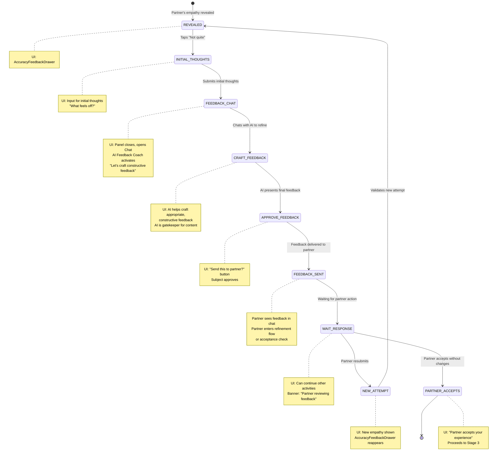
```mermaid
stateDiagram-v2
    [*] --> REVEALED: Partner's empathy revealed
    note right of REVEALED
        UI: AccuracyFeedbackDrawer
    end note

    REVEALED --> INITIAL_THOUGHTS: Taps "Not quite"
    note right of INITIAL_THOUGHTS
        UI: Input for initial thoughts<br/>"What feels off?"
    end note

    INITIAL_THOUGHTS --> FEEDBACK_CHAT: Submits initial thoughts
    note right of FEEDBACK_CHAT
        UI: Panel closes, opens Chat<br/>AI Feedback Coach activates<br/>"Let's craft constructive feedback"
    end note

    FEEDBACK_CHAT --> CRAFT_FEEDBACK: Chats with AI to refine
    note right of CRAFT_FEEDBACK
        UI: AI helps craft appropriate,<br/>constructive feedback<br/>AI is gatekeeper for content
    end note

    CRAFT_FEEDBACK --> APPROVE_FEEDBACK: AI presents final feedback
    note right of APPROVE_FEEDBACK
        UI: "Send this to partner?" button<br/>Subject approves
    end note

    APPROVE_FEEDBACK --> FEEDBACK_SENT: Feedback delivered to partner
    note right of FEEDBACK_SENT
        Partner sees feedback in chat<br/>Partner enters refinement flow<br/>or acceptance check
    end note

    FEEDBACK_SENT --> WAIT_RESPONSE: Waiting for partner action
    note right of WAIT_RESPONSE
        UI: Can continue other activities<br/>Banner: "Partner reviewing feedback"
    end note

    WAIT_RESPONSE --> NEW_ATTEMPT: Partner resubmits
    note right of NEW_ATTEMPT
        UI: New empathy shown<br/>AccuracyFeedbackDrawer reappears
    end note

    WAIT_RESPONSE --> PARTNER_ACCEPTS: Partner accepts without changes
    note right of PARTNER_ACCEPTS
        UI: "Partner accepts your experience"<br/>Proceeds to Stage 3
    end note

    NEW_ATTEMPT --> REVEALED: Validates new attempt
    PARTNER_ACCEPTS --> [*]
```

### 5.4 Guesser Perspective (Receives Inaccurate Feedback)

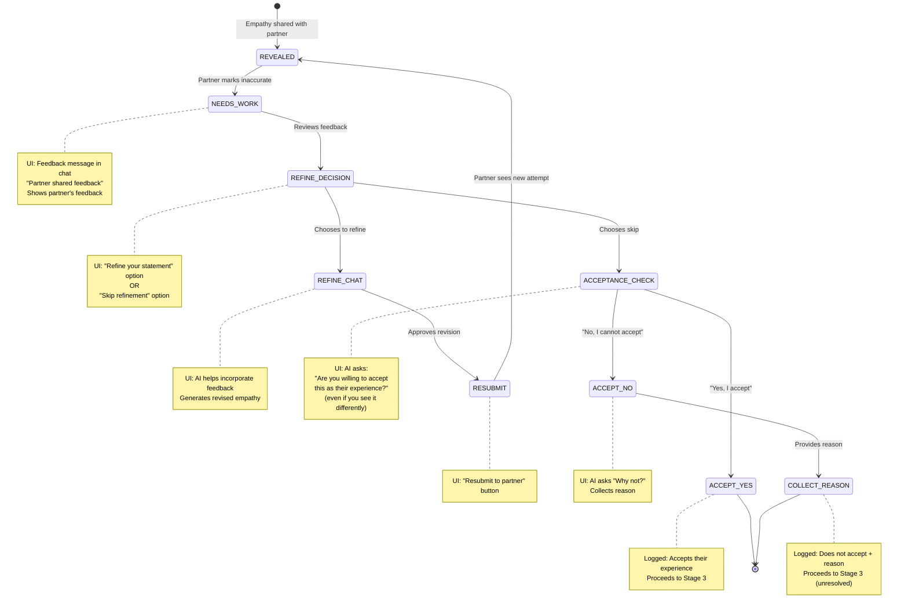
```mermaid
stateDiagram-v2
    [*] --> REVEALED: Empathy shared with partner

    REVEALED --> NEEDS_WORK: Partner marks inaccurate
    note right of NEEDS_WORK
        UI: Feedback message in chat<br/>"Partner shared feedback"<br/>Shows partner's feedback
    end note

    NEEDS_WORK --> REFINE_DECISION: Reviews feedback
    note right of REFINE_DECISION
        UI: "Refine your statement" option<br/>OR<br/>"Skip refinement" option
    end note

    REFINE_DECISION --> REFINE_CHAT: Chooses to refine
    note right of REFINE_CHAT
        UI: AI helps incorporate feedback<br/>Generates revised empathy
    end note

    REFINE_CHAT --> RESUBMIT: Approves revision
    note right of RESUBMIT
        UI: "Resubmit to partner" button
    end note

    RESUBMIT --> REVEALED: Partner sees new attempt

    REFINE_DECISION --> ACCEPTANCE_CHECK: Chooses skip
    note right of ACCEPTANCE_CHECK
        UI: AI asks:<br/>"Are you willing to accept<br/>this as their experience?"<br/>(even if you see it differently)
    end note

    ACCEPTANCE_CHECK --> ACCEPT_YES: "Yes, I accept"
    note right of ACCEPT_YES
        Logged: Accepts their experience<br/>Proceeds to Stage 3
    end note

    ACCEPTANCE_CHECK --> ACCEPT_NO: "No, I cannot accept"
    note right of ACCEPT_NO
        UI: AI asks "Why not?"<br/>Collects reason
    end note

    ACCEPT_NO --> COLLECT_REASON: Provides reason
    note right of COLLECT_REASON
        Logged: Does not accept + reason<br/>Proceeds to Stage 3 (unresolved)
    end note

    ACCEPT_YES --> [*]
    COLLECT_REASON --> [*]
```

## 6. Acceptance Check (Guesser Declines to Refine)

When the guesser receives shared context or feedback but chooses not to refine their empathy statement, the AI performs an acceptance check.

### 6.1 Guesser Perspective (Acceptance Check)

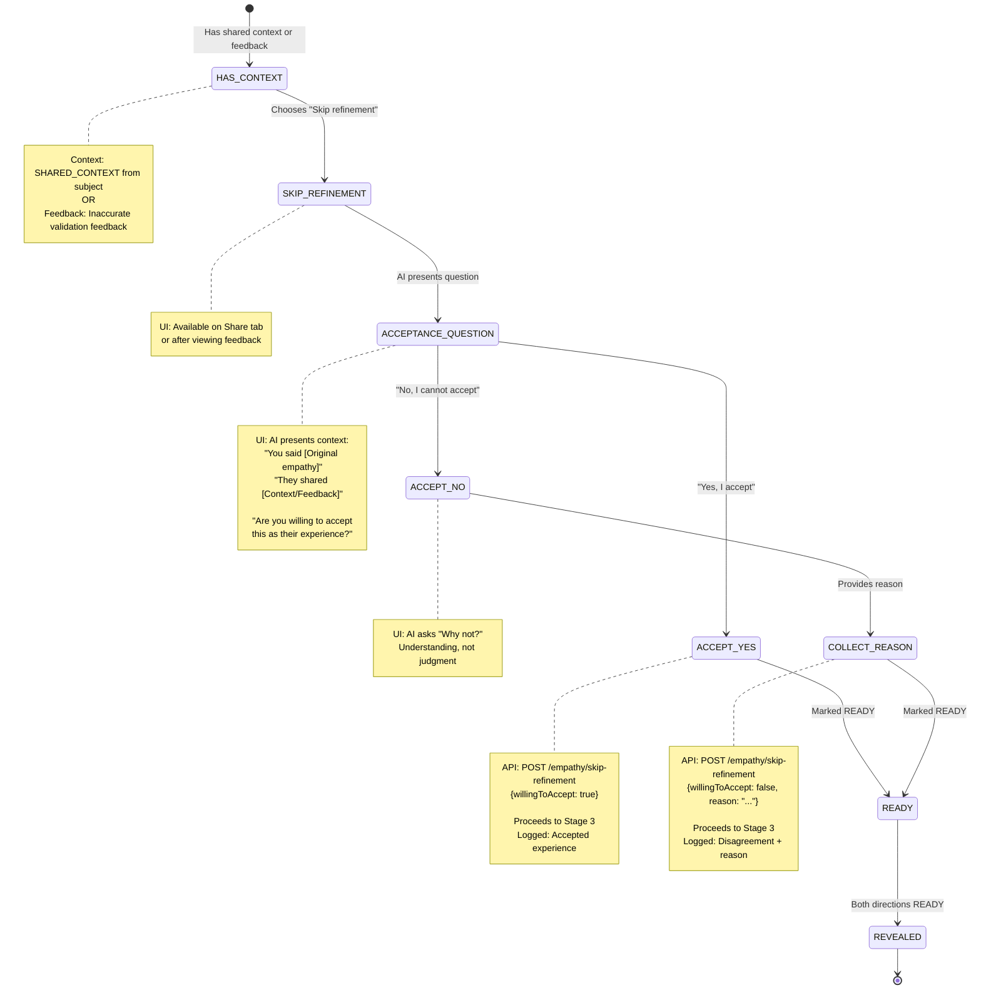
```mermaid
stateDiagram-v2
    [*] --> HAS_CONTEXT: Has shared context or feedback
    note right of HAS_CONTEXT
        Context: SHARED_CONTEXT from subject<br/>OR<br/>Feedback: Inaccurate validation feedback
    end note

    HAS_CONTEXT --> SKIP_REFINEMENT: Chooses "Skip refinement"
    note right of SKIP_REFINEMENT
        UI: Available on Share tab<br/>or after viewing feedback
    end note

    SKIP_REFINEMENT --> ACCEPTANCE_QUESTION: AI presents question
    note right of ACCEPTANCE_QUESTION
        UI: AI presents context:<br/>"You said [Original empathy]"<br/>"They shared [Context/Feedback]"<br/><br/>"Are you willing to accept<br/>this as their experience?"
    end note

    ACCEPTANCE_QUESTION --> ACCEPT_YES: "Yes, I accept"
    note right of ACCEPT_YES
        API: POST /empathy/skip-refinement<br/>{willingToAccept: true}<br/><br/>Proceeds to Stage 3<br/>Logged: Accepted experience
    end note

    ACCEPTANCE_QUESTION --> ACCEPT_NO: "No, I cannot accept"
    note right of ACCEPT_NO
        UI: AI asks "Why not?"<br/>Understanding, not judgment
    end note

    ACCEPT_NO --> COLLECT_REASON: Provides reason
    note right of COLLECT_REASON
        API: POST /empathy/skip-refinement<br/>{willingToAccept: false, reason: "..."}<br/><br/>Proceeds to Stage 3<br/>Logged: Disagreement + reason
    end note

    ACCEPT_YES --> READY: Marked READY
    COLLECT_REASON --> READY: Marked READY

    READY --> REVEALED: Both directions READY

    REVEALED --> [*]
```

### 6.2 Subject Perspective (Partner in Acceptance Check)

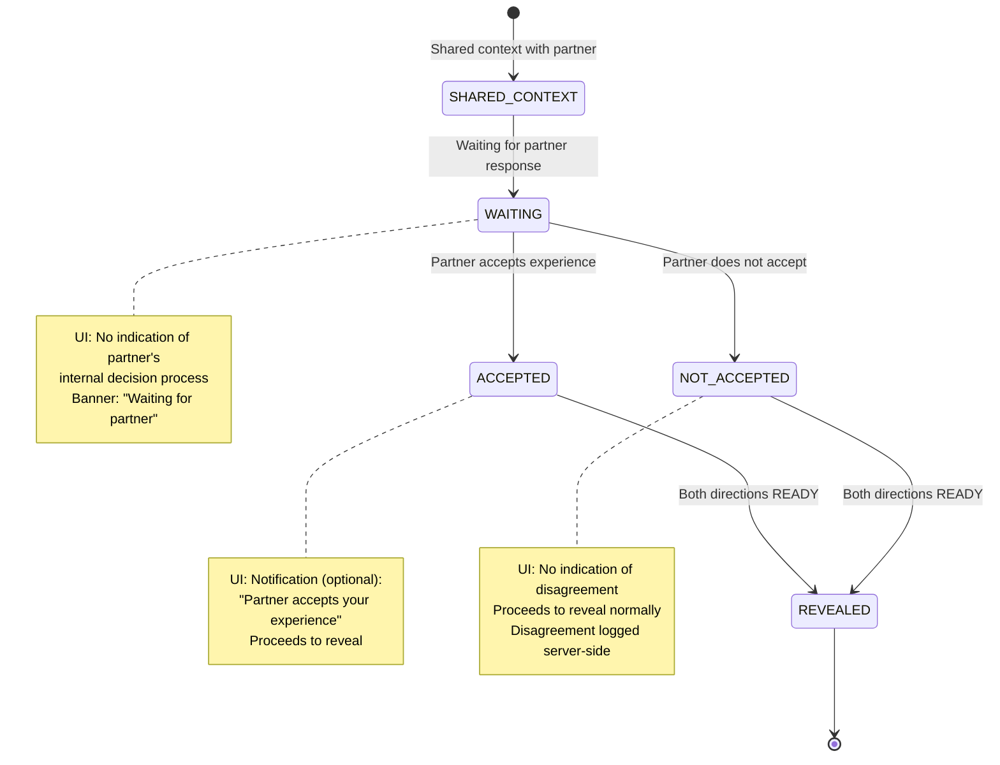
```mermaid
stateDiagram-v2
    [*] --> SHARED_CONTEXT: Shared context with partner

    SHARED_CONTEXT --> WAITING: Waiting for partner response
    note right of WAITING
        UI: No indication of partner's<br/>internal decision process<br/>Banner: "Waiting for partner"
    end note

    WAITING --> ACCEPTED: Partner accepts experience
    note right of ACCEPTED
        UI: Notification (optional):<br/>"Partner accepts your experience"<br/>Proceeds to reveal
    end note

    WAITING --> NOT_ACCEPTED: Partner does not accept
    note right of NOT_ACCEPTED
        UI: No indication of disagreement<br/>Proceeds to reveal normally<br/>Disagreement logged server-side
    end note

    ACCEPTED --> REVEALED: Both directions READY
    NOT_ACCEPTED --> REVEALED: Both directions READY

    REVEALED --> [*]
```

## Navigation and Persistence

### Content Persistence Requirements

All state diagrams assume content persists across navigation and sessions:

- **Chat page**: Full message history including SHARED_CONTEXT messages, AI reflections, and feedback
- **Share page**: Shows empathy drafts, refinement status, shared context, and action buttons
- **Panel state**: Reconstructed from cache data, not local state variables
- **Navigation**: Users can switch between Chat and Share tabs without losing context

### E2E Test Navigation Pattern

E2E tests validate persistence by:
1. Performing action on Chat page (e.g., sharing context)
2. Navigating to Share page
3. Verifying state is correct (e.g., "Context shared" indicator)
4. Navigating back to Chat page
5. Verifying content still present (e.g., SHARED_CONTEXT message)

## Diagram Legend

### State Types
- **Blue states**: Normal progression states
- **Yellow/orange states**: Decision points or waiting states
- **Green states**: Successful completion states

### Notes
- **UI**: What the user sees on screen (panels, buttons, banners)
- **API**: Backend calls made
- **Logged**: Server-side data recorded for analytics/debugging

### Transitions
- Solid arrows: Automatic transitions or user actions
- State labels describe the trigger (e.g., "Taps button", "Reconciler finds gaps")

## Implementation Reference

These diagrams are implemented across:
- **Backend**: `backend/src/services/reconciler.ts` (reconciler logic)
- **Mobile**: `mobile/src/components/` (panels and drawers)
- **Mobile**: `mobile/src/hooks/` (mutations and cache updates)
- **Shared**: `shared/src/dto/reconciler.ts` (types and contracts)

For detailed specs, see:
- `docs/specs/when-the-reconciler-responds-with-offeroptional-we-need-to-implement-this.md`
- `docs/user-flows/accuracy-feedback-flow.md`
- `docs/plans/2026-01-08-stage2-reconciler-flow-design.md`
