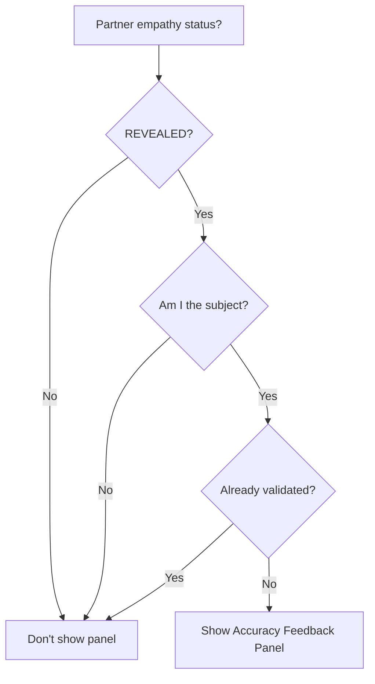
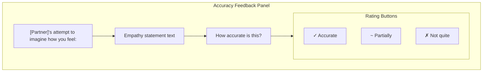
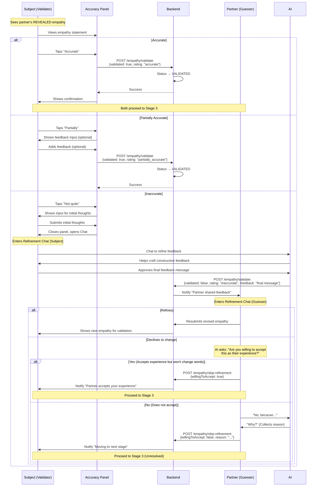

# Accuracy Feedback Flow

This document describes how users validate their partner's empathy attempt, including the UI component behavior and API interactions.

## Overview

After a user's empathy attempt is **REVEALED** to their partner (the subject), the subject can provide feedback on how accurately the guesser's attempt resonates with their actual feelings. This feedback determines whether the guesser needs to revise their empathy attempt.

## When Accuracy Feedback Appears

The accuracy feedback panel should appear when:
1. Partner's empathy status is `REVEALED` (not yet validated)
2. Current user is the "subject" (the one whose perspective the partner attempted to imagine)
3. No share suggestion panel is pending
4. User hasn't already submitted validation



## UI Components

### Panel Location

The accuracy feedback panel should appear **above the chat input**, not at the bottom of the screen. It follows the panel priority system:

```
┌─────────────────────────────────────┐
│           Chat Messages             │
│                                     │
│    [Partner's message]              │
│              [My message]           │
│    [AI message]                     │
│                                     │
├─────────────────────────────────────┤
│  ┌─────────────────────────────┐   │
│  │  Accuracy Feedback Panel    │   │  ← Panel area (above input)
│  │  [Partner name]'s           │   │
│  │  attempt to imagine         │   │
│  │  how you feel:              │   │
│  │  "Empathy statement..."     │   │
│  │                             │   │
│  │  How accurate is this?      │   │
│  │  [✓ Accurate] [~ Partial]   │   │
│  │  [✗ Inaccurate]             │   │
│  └─────────────────────────────┘   │
├─────────────────────────────────────┤
│  [Chat input box]                   │  ← Input area
└─────────────────────────────────────┘
```

### Panel Content



## User Interaction Flow



## AI Feedback Coach (Subject's Experience)
This flow mirrors the **Reconciler Share Suggestion** flow...

[... standard feedback coach details ...]

## Acceptance Check (Guesser's Experience)
If the Guesser cannot/will not refine their statement to match the Subject's feedback:
1. **AI Presentation**: "You said [Original], and they say [Feedback]. With this adjustment, they say their experience is accurately reflected."
2. **The Question**: "Are you willing to accept this as their experience?"
3. **Outcomes**:
    - **Yes**: "I accept that is their experience (even if I see it differently)." -> **Proceed**.
    - **No**: "I cannot accept that is their experience." -> AI asks **Why?** -> User answers -> **Proceed** (with disagreement logged).

## API Contract

### POST /sessions/:id/empathy/validate

**Request:**
```typescript
{
  validated: boolean;              // Overall validation (true for accurate/partial)
  rating: 'accurate' | 'partially_accurate' | 'inaccurate';
  feedback?: string;               // Optional for accurate/partial, required for inaccurate
}
```

**Response:**
```typescript
{
  success: true;
  myAttemptStatus: string;         // Current user's empathy status
  partnerValidated: boolean;       // Whether partner has validated current user's empathy
}
```

## State Transitions

### EmpathyAttempt Status

| Current Status | Validation Result | New Status |
|---------------|-------------------|------------|
| REVEALED | Accurate | VALIDATED |
| REVEALED | Partially accurate | VALIDATED |
| REVEALED | Inaccurate | NEEDS_WORK |

### What Happens Next

| New Status | For Subject | For Guesser |
|------------|-------------|-------------|
| VALIDATED | Panel closes, can proceed | Can proceed to Stage 3 |
| NEEDS_WORK | Panel closes | Sees refinement prompt, must revise |

## Frontend Implementation

### Query Dependencies

```typescript
// Fetch partner's empathy for validation
const { data: partnerEmpathy } = useQuery({
  queryKey: ['partnerEmpathy', sessionId],
  queryFn: () => api.getPartnerEmpathy(sessionId),
  enabled: !!sessionId,
});

// Check if validation panel should show
const shouldShowValidationPanel =
  partnerEmpathy?.status === 'REVEALED' &&
  !partnerEmpathy?.validation?.validatedAt;
```

### Cache Invalidation

After validation:
```typescript
queryClient.invalidateQueries(['partnerEmpathy', sessionId]);
queryClient.invalidateQueries(['empathyStatus', sessionId]);
```

### Panel Visibility Logic

```typescript
// In panel priority calculation
const panels = [
  { show: showCompactAgreementBar, priority: 1, component: CompactAgreementBar },
  { show: showInvitationPanel, priority: 2, component: InvitationPanel },
  { show: showFeelHeardPanel, priority: 3, component: FeelHeardPanel },
  { show: showShareSuggestionPanel, priority: 4, component: ShareSuggestionPanel },
  { show: shouldShowValidationPanel, priority: 5, component: AccuracyFeedbackPanel }, // <-- Here
  { show: showEmpathyPanel, priority: 6, component: EmpathyStatementPanel },
  { show: showWaitingBanner, priority: 7, component: WaitingBanner },
];

const activePanel = panels
  .filter(p => p.show)
  .sort((a, b) => a.priority - b.priority)[0];
```

## Known Issues

### Issue: Panel Position
**Problem:** Panel appears at bottom of screen instead of above chat input
**Expected:** Panel should be in the `AboveInputPanel` slot, same as other panels
**Fix:** Ensure `AccuracyFeedbackPanel` is rendered in the panel area, not as a separate absolute-positioned component

### Issue: Non-functional Buttons
**Problem:** Rating buttons don't trigger API calls
**Expected:** Tapping a button should call `POST /empathy/validate`
**Fix:** Connect button onPress handlers to mutation function

## Debugging

### Check if partner empathy is available
```typescript
// In React Query DevTools or console
queryClient.getQueryData(['partnerEmpathy', sessionId])
```

### Verify empathy status
```bash
cd backend
npx ts-node src/scripts/analyze-session.ts <sessionId>
```
Look for:
- Partner's empathy attempt status (should be `REVEALED`)
- Validation records (should be empty if not yet validated)
