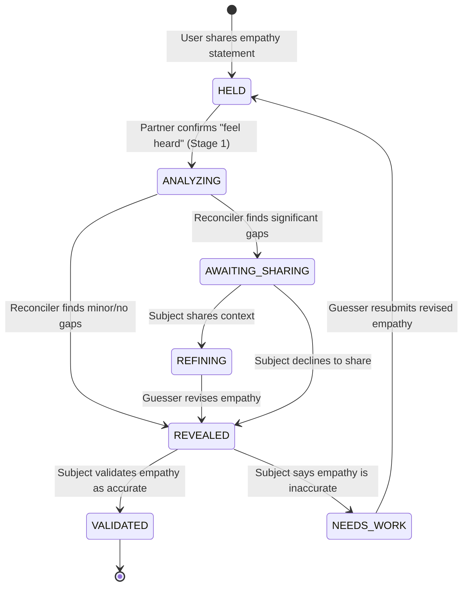
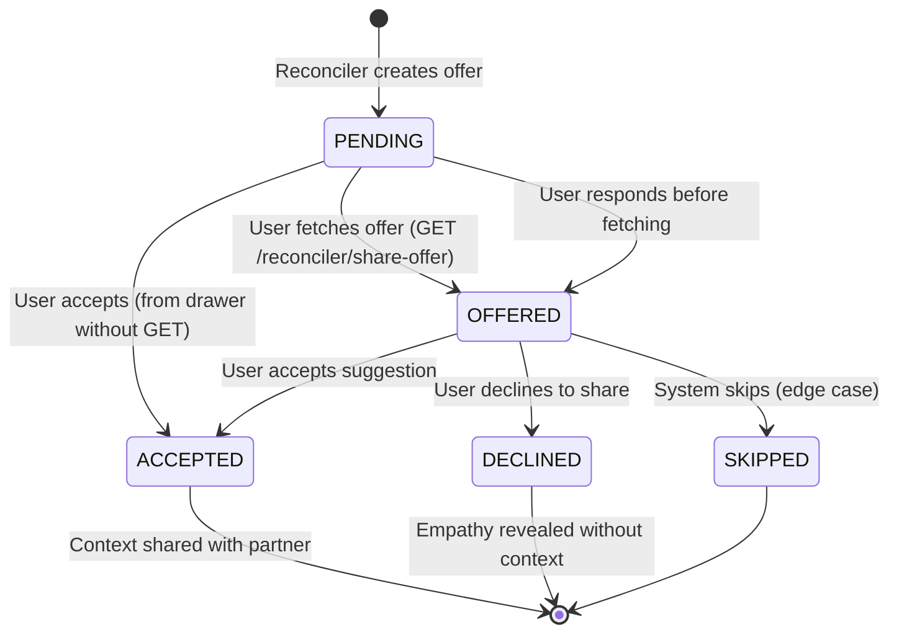
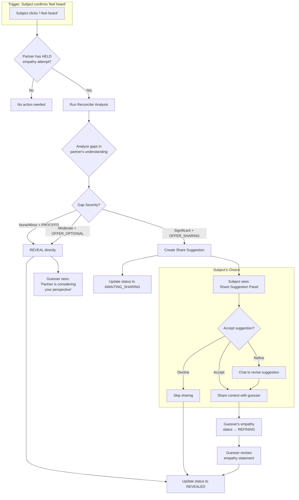
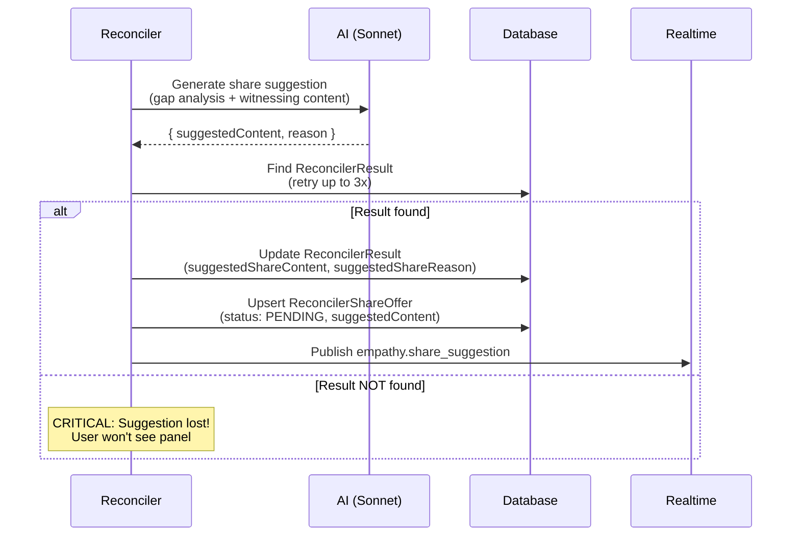
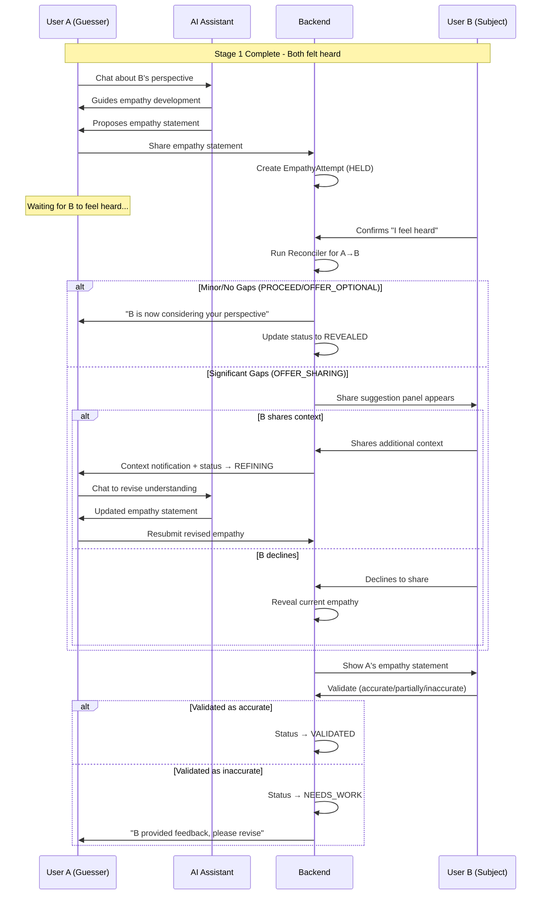
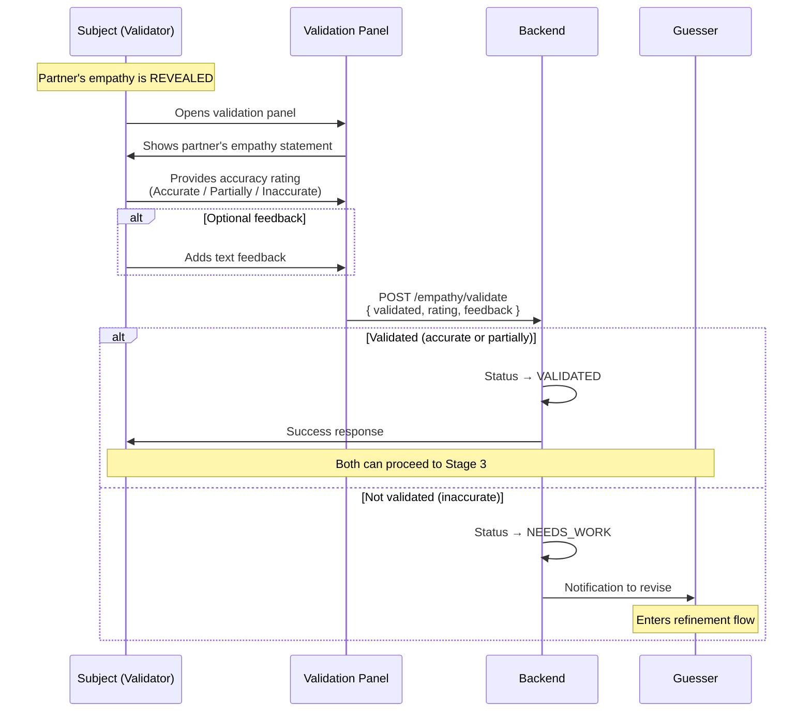
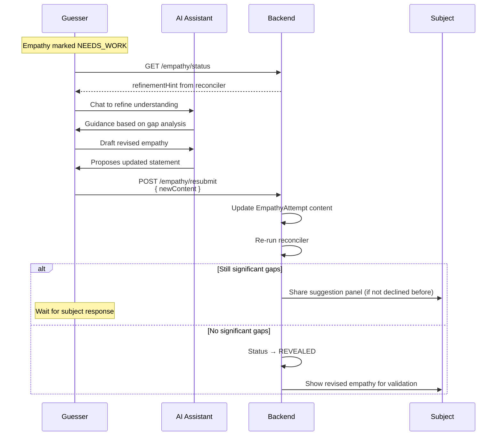
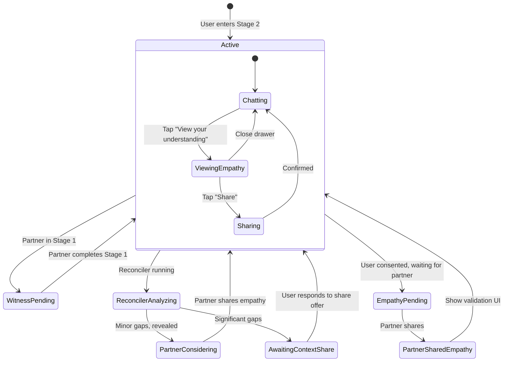

# Stage 2: Perspective Stretch - Empathy Exchange Flow

This document describes the empathy exchange flow in Stage 2, including the reconciler system that analyzes empathy accuracy and manages the sharing of additional context.

## Overview

In Stage 2, both users work to understand each other's perspective. Each user:
1. Chats with AI to develop their understanding of their partner's experience
2. Creates an empathy statement expressing that understanding
3. Shares the statement with their partner
4. Receives validation feedback on their empathy

The **Reconciler** analyzes how well each person understood the other and may suggest sharing additional context to help bridge gaps in understanding.

## Empathy Attempt States



## Share Offer States

The `ReconcilerShareOffer` tracks the suggestion lifecycle:



## Reconciler Flow

The reconciler runs when one user confirms "feel heard" (completing Stage 1) and their partner has an empathy attempt in `HELD` status.

### Reconciler Decision Tree



### Reconciler Actions by Gap Severity

| Gap Severity | Recommended Action | Effect on Guesser | Effect on Subject |
|--------------|-------------------|-------------------|-------------------|
| None | `PROCEED` | Empathy REVEALED immediately | Sees partner's empathy |
| Minor | `PROCEED` | Empathy REVEALED immediately | Sees partner's empathy |
| Moderate | `OFFER_OPTIONAL` | Empathy REVEALED immediately | Sees partner's empathy |
| Significant | `OFFER_SHARING` | Status → AWAITING_SHARING | Sees share suggestion panel |

### Share Suggestion Generation Flow



## User Experience: Both Users' Perspective

### User A (Guesser) Flow



### Validation Flow (After Empathy Revealed)



### Refinement Flow (When NEEDS_WORK)



## UI State Machine

The chat input visibility and above-input panels are controlled by the waiting status:



## Input Visibility Rules

| Waiting Status | Hide Input? | Show Banner? | Show Inner Thoughts? |
|---------------|-------------|--------------|---------------------|
| `null` | No | No | Depends on stage |
| `witness-pending` | Yes | Yes | Yes |
| `empathy-pending` | Yes | Yes | Yes |
| `partner-considering-perspective` | Yes | Yes | Yes |
| `reconciler-analyzing` | Yes | Yes (with spinner) | Yes |
| `awaiting-context-share` | No | Yes | No |
| `refining-empathy` | No | No | No |

## Panel Priority

Only one panel shows at a time, in this priority order:

1. **Compact Agreement Bar** - During onboarding
2. **Invitation Panel** - After signing, before sending invite
3. **Feel Heard Panel** - Stage 1 completion
4. **Share Suggestion Panel** - Subject must respond to share suggestion
5. **Accuracy Feedback Panel** - Partner's empathy available for validation
6. **Empathy Statement Panel** - User's empathy ready to review
7. **Waiting Banner** - Any waiting status

## Realtime Events

| Event | Trigger | Cache Invalidation | UI Update |
|-------|---------|-------------------|-----------|
| `empathy.share_suggestion` | Reconciler finds significant gaps | `shareOffer`, `empathyStatus` | Show share suggestion panel |
| `empathy.context_shared` | Subject shares additional context | `empathyStatus`, `shareOffer`, `messages` | Guesser sees shared context |
| `empathy.revealed` | Empathy revealed (no significant gaps) | `empathyStatus`, `partnerEmpathy` | Subject can validate |
| `partner.stage_completed` | Partner completes a stage | `empathyStatus`, `progress` | Update waiting status |
| `partner.session_viewed` | Partner views session | `empathyStatus` (delivery status) | Update delivery indicator |
| `empathy.validated` | Partner validates empathy | `empathyStatus` | Show validation result |

## Data Models

### EmpathyAttempt

```typescript
{
  id: string;
  sessionId: string;
  sourceUserId: string;       // The guesser
  content: string;            // The empathy statement
  status: 'HELD' | 'ANALYZING' | 'REVEALED' | 'AWAITING_SHARING' |
          'REFINING' | 'VALIDATED' | 'NEEDS_WORK';
  sharedAt: Date;             // When initially shared
  revealedAt: Date | null;    // When revealed to subject
  deliveryStatus: 'PENDING' | 'DELIVERED' | 'SEEN';
  deliveredAt: Date | null;
  seenAt: Date | null;
}
```

### ReconcilerResult

```typescript
{
  id: string;
  sessionId: string;
  guesserId: string;
  subjectId: string;
  guesserName: string;
  subjectName: string;
  alignmentScore: number;     // 0-100
  gapSeverity: 'none' | 'minor' | 'moderate' | 'significant';
  recommendedAction: 'PROCEED' | 'OFFER_OPTIONAL' | 'OFFER_SHARING';
  mostImportantGap: string | null;
  suggestedShareContent: string | null;   // From generateShareSuggestion
  suggestedShareReason: string | null;
}
```

### ReconcilerShareOffer

```typescript
{
  id: string;
  resultId: string;           // FK to ReconcilerResult
  userId: string;             // The subject who can share
  status: 'PENDING' | 'OFFERED' | 'ACCEPTED' | 'DECLINED' | 'SKIPPED';
  suggestedContent: string | null;        // AI-generated suggestion
  suggestedReason: string | null;
  customContent: string | null;           // User's refined content
  deliveryStatus: 'PENDING' | 'DELIVERED' | 'SEEN';
  createdAt: Date;
  sharedAt: Date | null;
  declinedAt: Date | null;
}
```

### EmpathyValidation

```typescript
{
  id: string;
  empathyAttemptId: string;
  userId: string;             // The validator (subject)
  validated: boolean;         // Overall validation
  rating: 'accurate' | 'partially_accurate' | 'inaccurate';
  feedback: string | null;    // Optional text feedback
  validatedAt: Date;
}
```

## Known Edge Cases

### Case 1: Race Condition on Reveal
If both users share empathy at nearly the same time, both reconcilers run. Need to handle:
- Both returning PROCEED → both reveal immediately
- One returning OFFER_SHARING → only one gets share suggestion

### Case 2: Refresh During Share Suggestion
If user refreshes while share suggestion is pending:
- Frontend fetches `/reconciler/share-offer`
- If status is `PENDING`, it becomes `OFFERED`
- Panel should reappear with suggestion

### Case 3: Validation Before Reconciler Completes
If user tries to validate partner's empathy before reconciler finishes:
- Frontend should wait for `empathy.revealed` event
- Or poll `empathyStatus` until attempt is in `REVEALED` status

### Case 4: Share Suggestion Without suggestedContent
**Issue discovered during debugging**: If `generateShareSuggestion` fails to find the `ReconcilerResult` (race condition), the `suggestedContent` will be null. The fix includes:
- Retry logic (3 attempts with 100ms delay) in `generateShareSuggestion`
- Frontend fallback to display `offerMessage` if `suggestedContent` is missing

### Case 5: User Responds Before Fetching Share Offer
If user accepts/declines before the GET endpoint marks offer as `OFFERED`:
- `respondToShareSuggestion` accepts both `PENDING` and `OFFERED` status
- Marks as `OFFERED` before processing for proper audit trail

## Debugging Tips

### Analyze Session State
Use the diagnostic script to get a complete view of a session:
```bash
cd backend
npx ts-node src/scripts/analyze-session.ts <sessionId>
```

This shows:
- Participant info
- Stage progress for each user
- Empathy drafts and attempts
- Reconciler results and share offers
- Chronological timeline of all events
- Potential issues detected

### Check Reconciler Logs
Look for these key log messages:
- `[Reconciler] Running asymmetric reconciliation` - Start of analysis
- `[Reconciler] Outcome analysis: severity=X, action=Y` - Decision made
- `[Reconciler] Share suggestion generated` - Suggestion created
- `[Reconciler] CRITICAL: Could not find reconcilerResult` - Race condition error

### Frontend Cache Issues
If UI doesn't update after Ably events:
- Check that `empathy.revealed` handler invalidates `empathyStatus`
- Verify `shareOffer` query is invalidated after `empathy.share_suggestion`
- Use React Query DevTools to inspect cache state
